# Pharos Search

## Logical View (C4 Component Diagram)

### Milestone 01: Establish a Monolithic Application Core

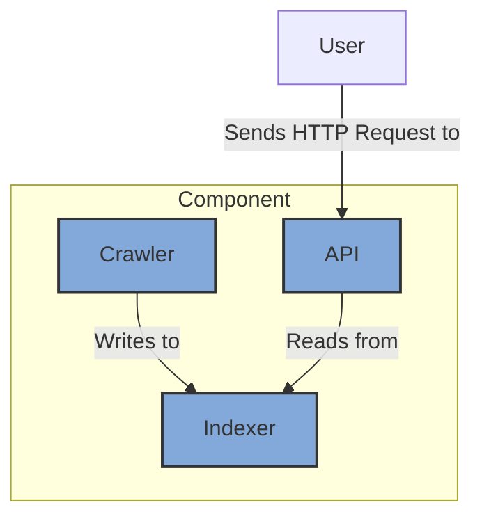
```mermaid
graph TD
    subgraph Monolithic Application Core [Component]
        Crawler -->|Writes to| Indexer
        API -->|Reads from| Indexer
    end

    User -->|Sends HTTP Request to| API

    %% Component Descriptions
    classDef component fill:#82a9d9,stroke:#333,stroke-width:2px;
    class Crawler,Indexer,API component;
```

### Milestone 02: Define an In-Memory Data Flow

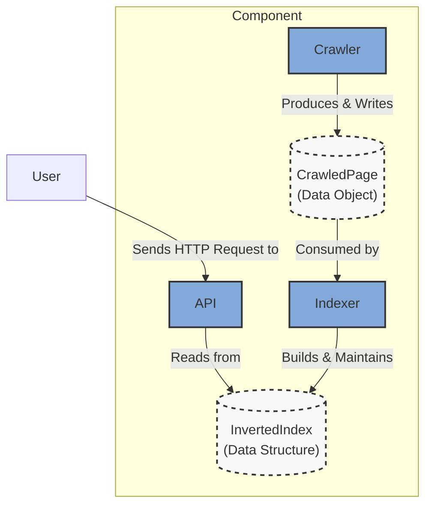
```mermaid
graph TD
    subgraph Monolithic Application Core [Component]
        Crawler --"Produces & Writes"--> CrawledPage[("CrawledPage\n(Data Object)")]
        CrawledPage -->|"Consumed by"| Indexer
        
        API --"Reads from"--> InvertedIndex[("InvertedIndex\n(Data Structure)")]
        Indexer --"Builds & Maintains"--> InvertedIndex
    end

    User -->|Sends HTTP Request to| API

    %% Component Descriptions
    classDef component fill:#82a9d9,stroke:#333,stroke-width:2px;
    class Crawler,Indexer,API component;

    classDef data fill:#f9f9f9,stroke:#333,stroke-width:2px,stroke-dasharray: 5 5;
    class CrawledPage,InvertedIndex data;
```

### Milestone 03: Expose Core Functionality via a Rudimentary API

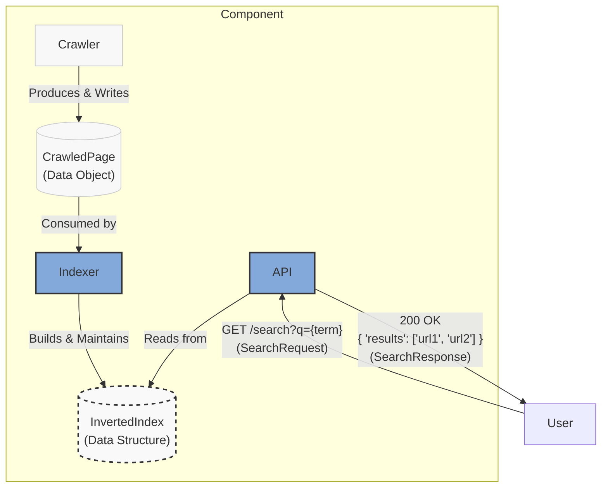
```mermaid
graph TD
    subgraph Monolithic Application Core [Component]
        
        API --"Reads from"--> InvertedIndex[("InvertedIndex\n(Data Structure)")]
        Indexer --"Builds & Maintains"--> InvertedIndex

        %% Hidden internal components for clarity
        Crawler --"Produces & Writes"--> CrawledPage[("CrawledPage\n(Data Object)")]
        CrawledPage -->|"Consumed by"| Indexer
        style Crawler fill:#f8f8f8,stroke:#ccc
        style CrawledPage fill:#f8f8f8,stroke:#ccc

    end

    User --"GET /search?q={term}<br/>(SearchRequest)"--> API
    API --"200 OK<br/>{ 'results': ['url1', 'url2'] }<br/>(SearchResponse)"--> User
    

    %% Component Descriptions
    classDef component fill:#82a9d9,stroke:#333,stroke-width:2px;
    class Indexer,API component;

    classDef data fill:#f9f9f9,stroke:#333,stroke-width:2px,stroke-dasharray: 5 5;
    class InvertedIndex data;
```

### Milestone 04: Introduce an Asynchronous Message Bus for Decoupling

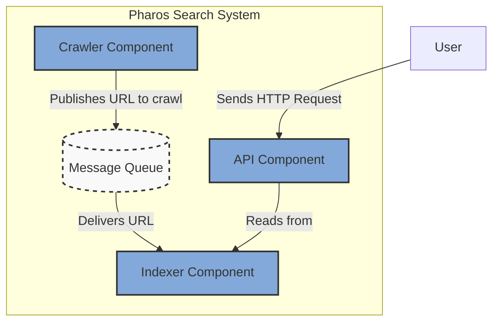
```mermaid
graph TD
    subgraph Pharos Search System
        Crawler[Crawler Component] --"Publishes URL to crawl"--> MessageQueue[("Message Queue")]
        MessageQueue --"Delivers URL"--> Indexer[Indexer Component]
        
        API[API Component] --"Reads from"--> Indexer
    end

    User -->|Sends HTTP Request| API

    %% Component Descriptions
    classDef component fill:#82a9d9,stroke:#333,stroke-width:2px;
    class Crawler,Indexer,API component;

    classDef data fill:#f9f9f9,stroke:#333,stroke-width:2px,stroke-dasharray: 5 5;
    class MessageQueue data;
```

### Milestone 05: Establish a Centralized, Durable Content Store

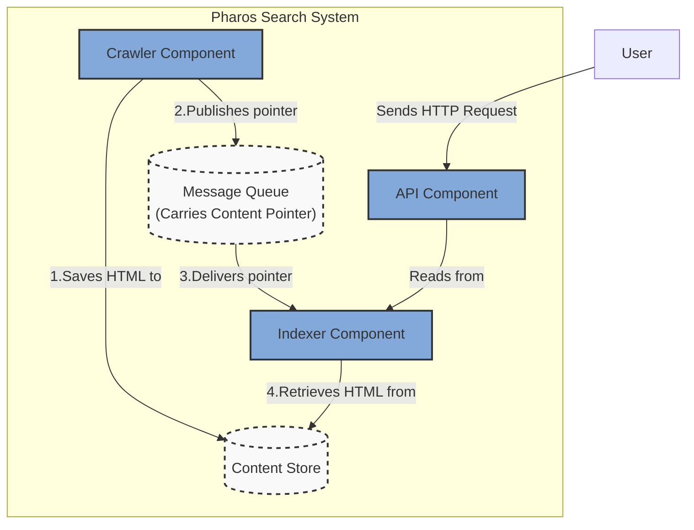
```mermaid
graph TD
    subgraph Pharos Search System
        Crawler[Crawler Component] --"1.Saves HTML to"--> ContentStore[("Content Store")]
        Crawler --"2.Publishes pointer"--> MessageQueue[("Message Queue\n(Carries Content Pointer)")]
        
        MessageQueue --"3.Delivers pointer"--> Indexer[Indexer Component]
        Indexer --"4.Retrieves HTML from"--> ContentStore

        API[API Component] --"Reads from"--> Indexer
    end

    User -->|Sends HTTP Request| API

    %% Component Descriptions
    classDef component fill:#82a9d9,stroke:#333,stroke-width:2px;
    class Crawler,Indexer,API component;

    classDef data fill:#f9f9f9,stroke:#333,stroke-width:2px,stroke-dasharray: 5 5;
    class MessageQueue,ContentStore data;
```

### Milestone 06: Evolve the Index into a Persistent, Sharded Data Store

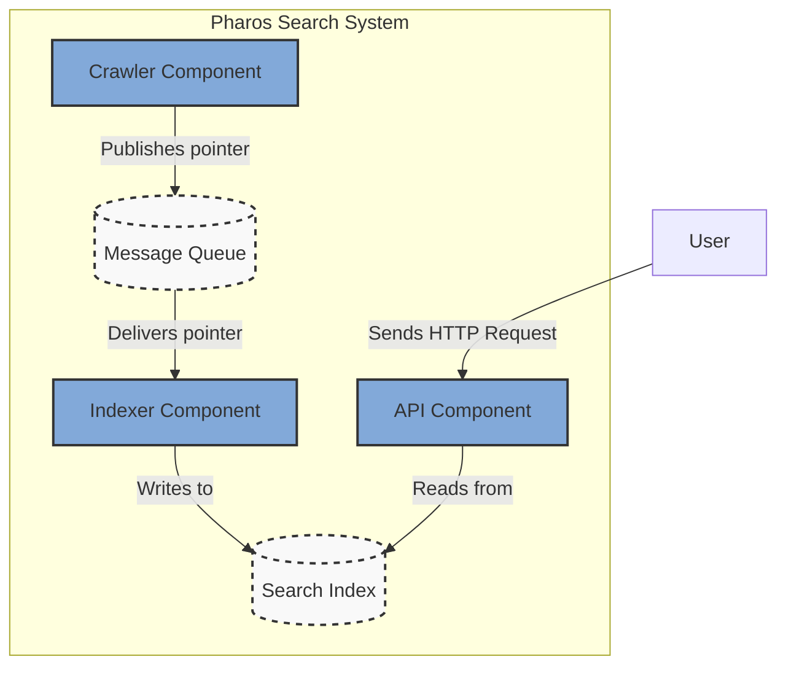
```mermaid
graph TD
    subgraph Pharos Search System
        Indexer[Indexer Component] --"Writes to"--> SearchIndex[("Search Index")]
        API[API Component] --"Reads from"--> SearchIndex

        %% Upstream components
        Crawler[Crawler Component] --"Publishes pointer"--> MessageQueue[("Message Queue")]
        MessageQueue --"Delivers pointer"--> Indexer
    end

    User -->|Sends HTTP Request| API

    %% Component Descriptions
    classDef component fill:#82a9d9,stroke:#333,stroke-width:2px;
    class Crawler,Indexer,API component;

    classDef data fill:#f9f9f9,stroke:#333,stroke-width:2px,stroke-dasharray: 5 5;
    class MessageQueue,SearchIndex data;
```

### Milestone 07: Define the Infrastructure-as-Code (IaC) and Containerization Strategy

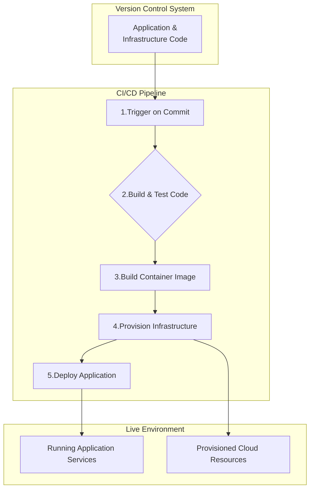
```mermaid
graph TD
    subgraph "Version Control System"
        CodeRepo["Application &<br/>Infrastructure Code"]
    end

    subgraph "CI/CD Pipeline"
        A[1.Trigger on Commit] --> B{2.Build & Test Code};
        B --> C[3.Build Container Image];
        C --> D[4.Provision Infrastructure];
        D --> E[5.Deploy Application];
    end

    subgraph "Live Environment"
        F[Running Application Services]
        G[Provisioned Cloud Resources]
    end

    CodeRepo --> A;
    E --> F;
    D --> G;
```

### Milestone 08: Introduce a Pluggable Ranking and Relevancy Subsystem

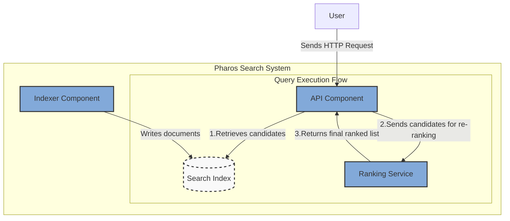
```mermaid
graph TD
    subgraph Pharos Search System
        subgraph "Query Execution Flow"
            direction LR
            API[API Component] --"1.Retrieves candidates"--> SearchIndex[("Search Index")]
            API --"2.Sends candidates for re-ranking"--> RankingSvc[Ranking Service]
            RankingSvc --"3.Returns final ranked list"--> API
        end

        %% Data Ingestion Flow (for context)
        Indexer[Indexer Component] --"Writes documents"--> SearchIndex
    end

    User --"Sends HTTP Request"--> API

    %% Component Descriptions
    classDef component fill:#82a9d9,stroke:#333,stroke-width:2px;
    class Indexer,API,RankingSvc component;

    classDef data fill:#f9f9f9,stroke:#333,stroke-width:2px,stroke-dasharray: 5 5;
    class SearchIndex data;
```

### Milestone 09: Formalize the URL Frontier as a Dedicated Service

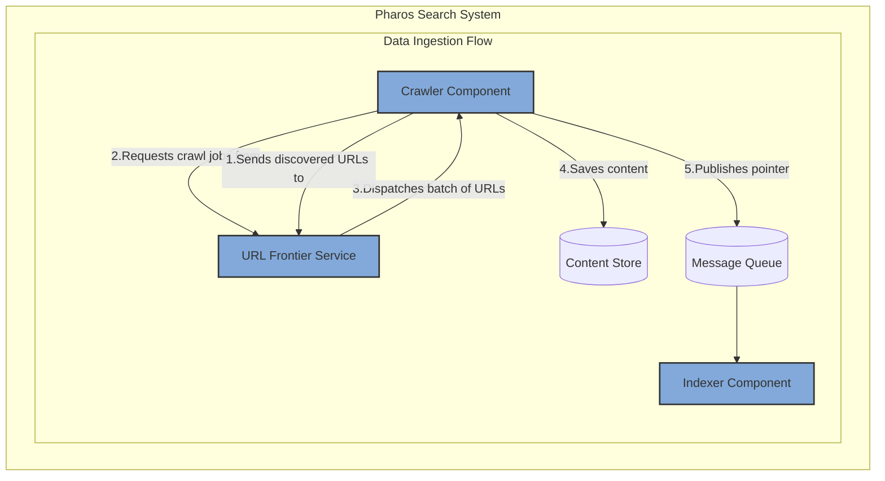
```mermaid
graph TD
    subgraph Pharos Search System
        subgraph "Data Ingestion Flow"
            Crawler[Crawler Component] --"2.Requests crawl jobs from"--> UrlFrontier[URL Frontier Service]
            UrlFrontier --"3.Dispatches batch of URLs"--> Crawler
            Crawler --"1.Sends discovered URLs to"--> UrlFrontier
            
            %% Downstream Flow remains the same
            Crawler --"4.Saves content"--> ContentStore[("Content Store")]
            Crawler --"5.Publishes pointer"--> MessageQueue[("Message Queue")]
            MessageQueue --> Indexer[Indexer Component]
        end
    end

    %% Component Descriptions
    classDef component fill:#82a9d9,stroke:#333,stroke-width:2px;
    class Crawler,Indexer,UrlFrontier component;
```

### Milestone 10: Establish a Data Processing Pipeline for Enrichment

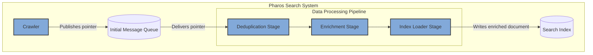
```mermaid
graph TD
    subgraph Pharos Search System
        subgraph "Data Processing Pipeline"
            direction LR
            Deduplication[Deduplication Stage] --> Enrichment[Enrichment Stage]
            Enrichment --> Loader[Index Loader Stage]
        end

        %% Upstream Flow
        MessageQueue[("Initial Message Queue")] --"Delivers pointer"--> Deduplication

        %% Downstream
        Loader --"Writes enriched document"--> SearchIndex[("Search Index")]

        %% Other components for context
        Crawler --"Publishes pointer"--> MessageQueue
    end

    %% Component Descriptions
    classDef component fill:#82a9d9,stroke:#333,stroke-width:2px;
    class Deduplication,Enrichment,Loader,Crawler component;
```

### Milestone 11: Integrate a Distributed Caching Layer

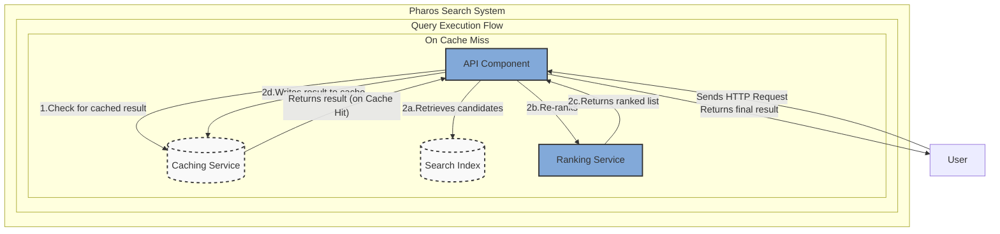
```mermaid
graph TD
    subgraph Pharos Search System
        subgraph "Query Execution Flow"
            API[API Component] --"1.Check for cached result"--> CachingSvc[("Caching Service")]
            
            subgraph "On Cache Miss"
                direction LR
                API --"2a.Retrieves candidates"--> SearchIndex[("Search Index")]
                API --"2b.Re-ranks"--> RankingSvc[Ranking Service]
                RankingSvc --"2c.Returns ranked list"--> API
                API --"2d.Writes result to cache"--> CachingSvc
            end
        end
        CachingSvc --"Returns result (on Cache Hit)"--> API
    end

    User --"Sends HTTP Request"--> API
    API --"Returns final result"--> User

    %% Component Descriptions
    classDef component fill:#82a9d9,stroke:#333,stroke-width:2px;
    class API,RankingSvc component;

    classDef data fill:#f9f9f9,stroke:#333,stroke-width:2px,stroke-dasharray: 5 5;
    class SearchIndex,CachingSvc data;
```

### Overall Logical View (C4 Component Diagram)

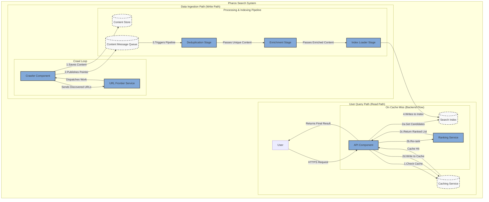
```mermaid
graph TD
    %% Define Styles
    classDef component fill:#82a9d9,stroke:#333,stroke-width:2px;
    classDef data fill:#f9f9f9,stroke:#333,stroke-width:2px,stroke-dasharray: 5 5;

    %% Main System Boundary
    subgraph Pharos Search System

        %% =============================================
        %% Query / Read Path
        %% =============================================
        subgraph "User Query Path (Read Path)"
            User -- "HTTPS Request" --> API[API Component]
            API -- "1.Check Cache" --> Cache[("Caching Service")]
            Cache -- "Cache Hit" --> API
            
            subgraph "On Cache Miss (Backend Flow)"
                direction LR
                API -- "2a.Get Candidates" --> SearchIndex[("Search Index")]
                API -- "2b.Re-rank" --> Ranking[Ranking Service]
                Ranking -- "2c.Return Ranked List" --> API
            end
            API -- "2d.Write to Cache" --> Cache
            API -- "Returns Final Result" --> User
        end

        %% =============================================
        %% Data Ingestion / Write Path
        %% =============================================
        subgraph "Data Ingestion Path (Write Path)"
            %% Crawl Loop
            subgraph "Crawl Loop"
                Crawler[Crawler Component] -- "Sends Discovered URLs" --> Frontier[URL Frontier Service]
                Frontier -- "Dispatches Work" --> Crawler
            end

            %% Processing & Indexing Pipeline
            subgraph "Processing & Indexing Pipeline"
                Crawler -- "1.Saves Content" --> ContentStore[("Content Store")]
                Crawler -- "2.Publishes Pointer" --> ContentQueue[("Content Message Queue")]
                
                ContentQueue -- "3.Triggers Pipeline" --> Deduplication[Deduplication Stage]
                Deduplication -- "Passes Unique Content" --> Enrichment[Enrichment Stage]
                Enrichment -- "Passes Enriched Content" --> Loader[Index Loader Stage]
                Loader -- "4.Writes to Index" --> SearchIndex
            end
        end
    end

    %% Apply Styles to all defined components and data stores
    class API,Ranking,Crawler,Frontier,Deduplication,Enrichment,Loader component;
    class Cache,SearchIndex,ContentStore,ContentQueue data;
```

## Physical View (Deployment Diagram)

### Milestone 01: Establish a Monolithic Application Core

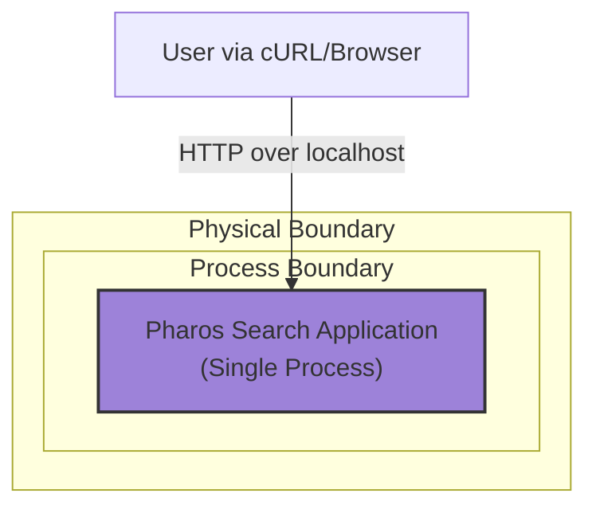
```mermaid
graph TD
    subgraph "Developer's Laptop" [Physical Boundary]
        subgraph "Docker Container" [Process Boundary]
            direction LR
            Monolith["Pharos Search Application\n(Single Process)"]
        end
    end

    User[User via cURL/Browser] -->|HTTP over localhost| Monolith

    %% Technology Choices
    classDef tech fill:#9d82d9,stroke:#333,stroke-width:2px;
    class Monolith tech;
```

### Milestone 02: Define an In-Memory Data Flow

```mermaid
graph TD
    subgraph "Developer's Laptop" [Physical Boundary]
        subgraph "Docker Container" [Process Boundary]
            direction LR
            Monolith["Pharos Search Application\n(Single Process)"]
        end
    end

    User[User via cURL/Browser] -->|HTTP over localhost| Monolith

    %% Technology Choices
    classDef tech fill:#9d82d9,stroke:#333,stroke-width:2px;
    class Monolith tech;
```

### Milestone 03: Expose Core Functionality via a Rudimentary API

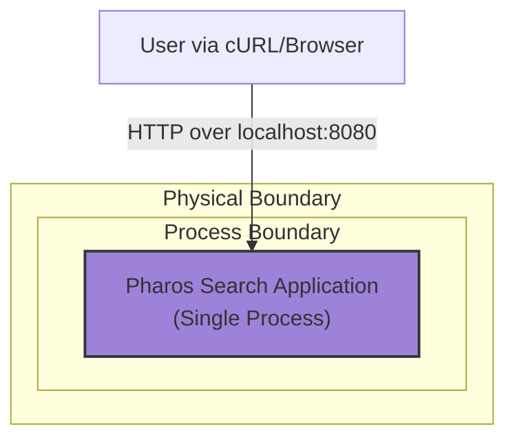
```mermaid
graph TD
    subgraph "Developer's Laptop" [Physical Boundary]
        subgraph "Docker Container" [Process Boundary]
            direction LR
            Monolith["Pharos Search Application\n(Single Process)"]
        end
    end

    User[User via cURL/Browser] -->|HTTP over localhost:8080| Monolith

    %% Technology Choices
    classDef tech fill:#9d82d9,stroke:#333,stroke-width:2px;
    class Monolith tech;
```

### Milestone 04: Introduce an Asynchronous Message Bus for Decoupling

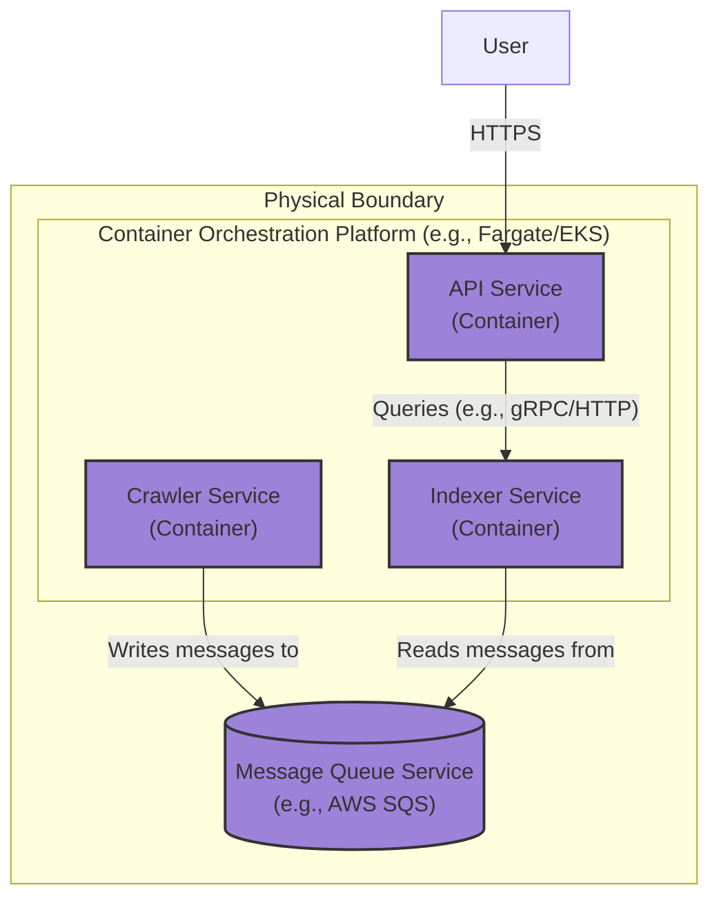
```mermaid
graph TD
    subgraph "Cloud Environment (e.g., AWS)" [Physical Boundary]
        
        subgraph "Container Orchestration Platform (e.g., Fargate/EKS)"
            CrawlerSvc["Crawler Service\n(Container)"]
            IndexerSvc["Indexer Service\n(Container)"]
            ApiSvc["API Service\n(Container)"]
        end

        MessageBus[("Message Queue Service\n(e.g., AWS SQS)")]

        CrawlerSvc -->|Writes messages to| MessageBus
        IndexerSvc -->|Reads messages from| MessageBus
        ApiSvc -->|"Queries (e.g., gRPC/HTTP)"| IndexerSvc
    end

    User -->|HTTPS| ApiSvc

    %% Technology Choices
    classDef tech fill:#9d82d9,stroke:#333,stroke-width:2px;
    class CrawlerSvc,IndexerSvc,ApiSvc,MessageBus tech;
```

### Milestone 05: Establish a Centralized, Durable Content Store

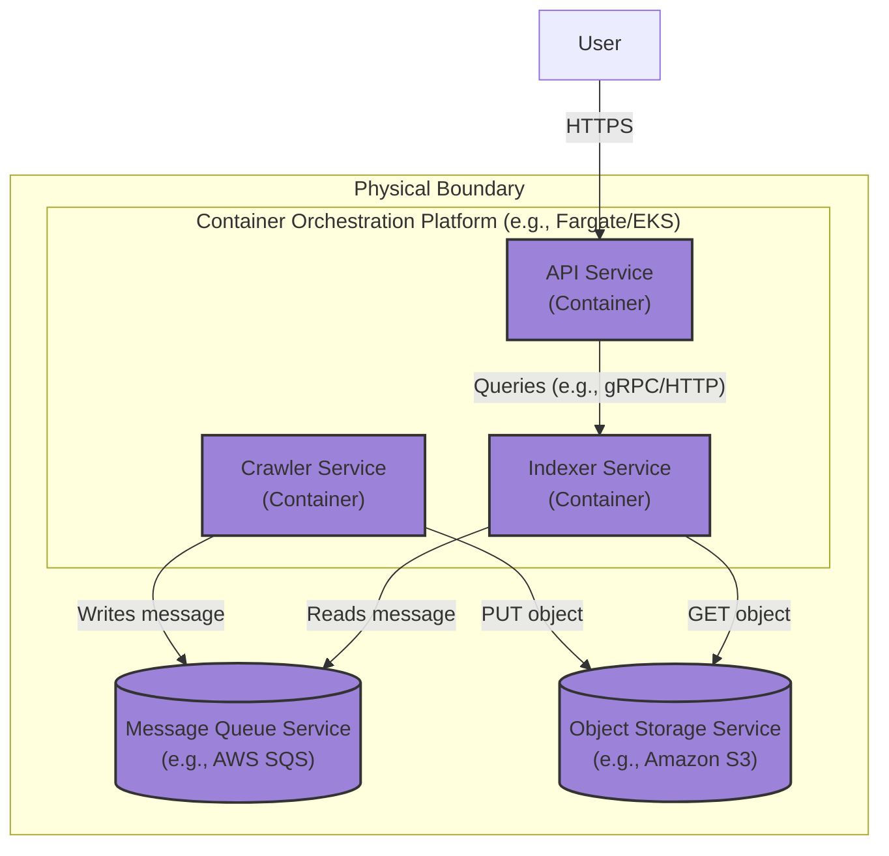
```mermaid
graph TD
    subgraph "Cloud Environment (e.g., AWS)" [Physical Boundary]
        
        subgraph "Container Orchestration Platform (e.g., Fargate/EKS)"
            CrawlerSvc["Crawler Service\n(Container)"]
            IndexerSvc["Indexer Service\n(Container)"]
            ApiSvc["API Service\n(Container)"]
        end

        MessageBus[("Message Queue Service\n(e.g., AWS SQS)")]
        ObjectStore[("Object Storage Service\n(e.g., Amazon S3)")]

        CrawlerSvc --"PUT object"--> ObjectStore
        CrawlerSvc --"Writes message"--> MessageBus
        
        IndexerSvc --"Reads message"--> MessageBus
        IndexerSvc --"GET object"--> ObjectStore

        ApiSvc --"Queries (e.g., gRPC/HTTP)"--> IndexerSvc
    end

    User -->|HTTPS| ApiSvc

    %% Technology Choices
    classDef tech fill:#9d82d9,stroke:#333,stroke-width:2px;
    class CrawlerSvc,IndexerSvc,ApiSvc,MessageBus,ObjectStore tech;
```

### Milestone 06: Evolve the Index into a Persistent, Sharded Data Store

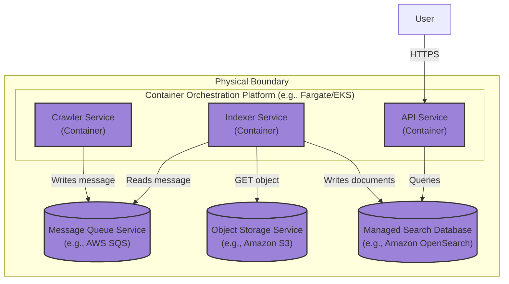
```mermaid
graph TD
    subgraph "Cloud Environment (e.g., AWS)" [Physical Boundary]
        
        subgraph "Container Orchestration Platform (e.g., Fargate/EKS)"
            CrawlerSvc["Crawler Service\n(Container)"]
            IndexerSvc["Indexer Service\n(Container)"]
            ApiSvc["API Service\n(Container)"]
        end

        MessageBus[("Message Queue Service\n(e.g., AWS SQS)")]
        ObjectStore[("Object Storage Service\n(e.g., Amazon S3)")]
        SearchDB[("Managed Search Database\n(e.g., Amazon OpenSearch)")]

        %% Data Flow
        CrawlerSvc --"Writes message"--> MessageBus
        IndexerSvc --"Reads message"--> MessageBus
        IndexerSvc --"GET object"--> ObjectStore
        IndexerSvc --"Writes documents"--> SearchDB
        ApiSvc --"Queries"--> SearchDB
    end

    User -->|HTTPS| ApiSvc

    %% Technology Choices
    classDef tech fill:#9d82d9,stroke:#333,stroke-width:2px;
    class CrawlerSvc,IndexerSvc,ApiSvc,MessageBus,ObjectStore,SearchDB tech;
```

### Milestone 07: Define the Infrastructure-as-Code (IaC) and Containerization Strategy

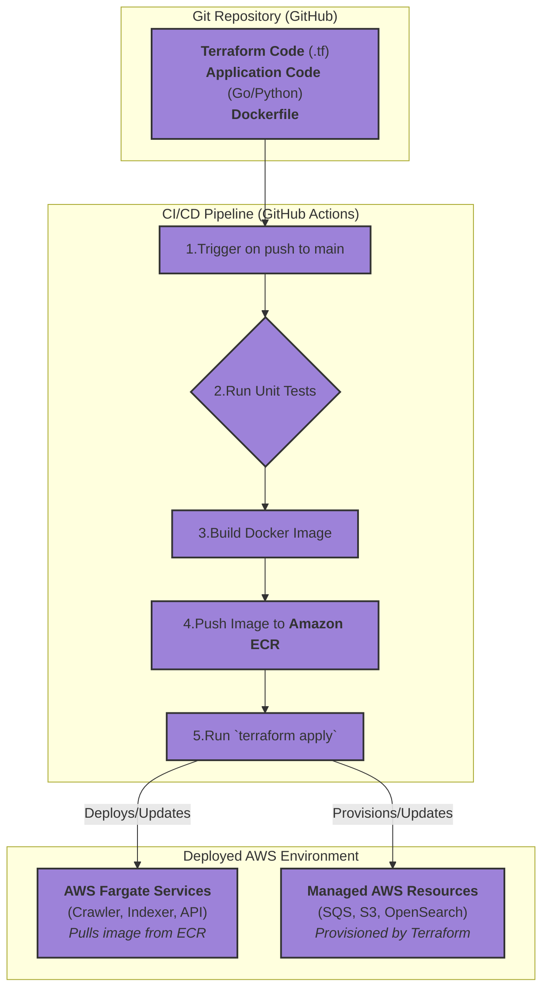
```mermaid
graph TD
    subgraph "Git Repository (GitHub)"
        CodeRepo["<b>Terraform Code</b> (.tf)<br/><b>Application Code</b> (Go/Python)<br/><b>Dockerfile</b>"]
    end

    subgraph "CI/CD Pipeline (GitHub Actions)"
        A[1.Trigger on push to main] --> B{2.Run Unit Tests};
        B --> C[3.Build Docker Image];
        C --> D[4.Push Image to <b>Amazon ECR</b>];
        D --> E[5.Run `terraform apply`];
    end
    
    subgraph "Deployed AWS Environment"
        F["<b>AWS Fargate Services</b><br/>(Crawler, Indexer, API)<br/><i>Pulls image from ECR</i>"]
        G["<b>Managed AWS Resources</b><br/>(SQS, S3, OpenSearch)<br/><i>Provisioned by Terraform</i>"]
    end

    CodeRepo --> A;
    E -- "Deploys/Updates" --> F;
    E -- "Provisions/Updates" --> G;

    classDef tech fill:#9d82d9,stroke:#333,stroke-width:2px;
    class CodeRepo,A,B,C,D,E,F,G tech;
```

### Milestone 08: Introduce a Pluggable Ranking and Relevancy Subsystem

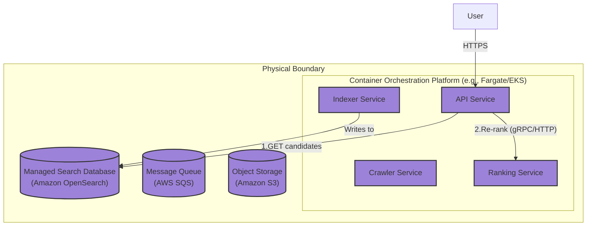
```mermaid
graph TD
    subgraph "Cloud Environment (e.g., AWS)" [Physical Boundary]
        
        subgraph "Container Orchestration Platform (e.g., Fargate/EKS)"
            CrawlerSvc[Crawler Service]
            IndexerSvc[Indexer Service]
            ApiSvc[API Service]
            RankingSvc[Ranking Service]
        end

        MessageBus[("Message Queue\n(AWS SQS)")]
        ObjectStore[("Object Storage\n(Amazon S3)")]
        SearchDB[("Managed Search Database\n(Amazon OpenSearch)")]

        %% Data Flow
        IndexerSvc --"Writes to"--> SearchDB
        ApiSvc --"1.GET candidates"--> SearchDB
        ApiSvc --"2.Re-rank (gRPC/HTTP)"--> RankingSvc
    end

    User -->|HTTPS| ApiSvc

    %% Technology Choices
    classDef tech fill:#9d82d9,stroke:#333,stroke-width:2px;
    class CrawlerSvc,IndexerSvc,ApiSvc,RankingSvc,MessageBus,ObjectStore,SearchDB tech;
```

### Milestone 09: Formalize the URL Frontier as a Dedicated Service

```mermaid
graph TD
    subgraph "Cloud Environment (e.g., AWS)" [Physical Boundary]
        
        subgraph "Container Orchestration Platform (e.g., Fargate/EKS)"
            CrawlerSvc[Crawler Service]
            IndexerSvc[Indexer Service]
            ApiSvc[API Service]
            RankingSvc[Ranking Service]
            UrlFrontierSvc[URL Frontier Service]
        end

        UrlDB[("URL Database\n(e.g., Amazon DynamoDB)")]
        %% Other managed services
        MessageBus[("Message Queue\n(AWS SQS)")]
        ObjectStore[("Object Storage\n(Amazon S3)")]
        SearchDB[("Managed Search Database\n(Amazon OpenSearch)")]

        %% New Crawl Loop
        CrawlerSvc --"Discovered URLs (gRPC/HTTP)"--> UrlFrontierSvc
        UrlFrontierSvc --"Requests work (gRPC/HTTP)"--> CrawlerSvc
        UrlFrontierSvc --"Reads/Writes URLs"--> UrlDB
        
        %% Existing Ingestion Flow
        CrawlerSvc --"Writes message"--> MessageBus
        IndexerSvc --"Reads message"--> MessageBus
    end
```

### Milestone 10: Establish a Data Processing Pipeline for Enrichment

```mermaid
graph TD
    subgraph "Cloud Environment (e.g., AWS)" [Physical Boundary]
        
        subgraph "Container Orchestration Platform (e.g., Fargate/EKS)"
            CrawlerSvc[Crawler Service]
            DeduplicationSvc[Deduplication Service]
            EnrichmentSvc[Enrichment Service]
            LoaderSvc[Index Loader Service]
            %% Other services
            ApiSvc[API Service]
            RankingSvc[Ranking Service]
            UrlFrontierSvc[URL Frontier Service]
        end

        %% Queues for the new pipeline
        InitialQueue[("Content Queue\n(AWS SQS)")]
        EnrichmentQueue[("Enrichment Queue\n(AWS SQS)")]
        LoaderQueue[("Loader Queue\n(AWS SQS)")]

        %% Other managed services
        ObjectStore[("Object Storage\n(Amazon S3)")]
        SearchDB[("Managed Search Database\n(Amazon OpenSearch)")]

        %% Pipeline Flow
        CrawlerSvc --> InitialQueue
        DeduplicationSvc --"Reads from"--> InitialQueue
        DeduplicationSvc --"GET object"--> ObjectStore
        DeduplicationSvc --"Writes to"--> EnrichmentQueue
        EnrichmentSvc --"Reads from"--> EnrichmentQueue
        EnrichmentSvc --"Writes to"--> LoaderQueue
        LoaderSvc --"Reads from"--> LoaderQueue
        LoaderSvc --"Writes documents"--> SearchDB
    end
```

### Milestone 11: Integrate a Distributed Caching Layer

```mermaid
graph TD
    subgraph "Cloud Environment (e.g., AWS)" [Physical Boundary]
        
        subgraph "Container Orchestration Platform (e.g., Fargate/EKS)"
            ApiSvc[API Service]
            RankingSvc[Ranking Service]
            %% Other services shown for context
            IndexerSvc[Indexer Service]
            CrawlerSvc[Crawler Service]
        end

        CachingDB[("In-Memory Cache Service\n(e.g., Amazon ElastiCache for Redis)")]
        SearchDB[("Managed Search Database\n(Amazon OpenSearch)")]

        %% Query Flow
        ApiSvc --"1.GET from cache"--> CachingDB
        ApiSvc --"2a.Query (on miss)"--> SearchDB
        ApiSvc --"2b.Re-rank (on miss)"--> RankingSvc
        ApiSvc --"2d.SET to cache (on miss)"--> CachingDB
    end

    User -->|HTTPS| ApiSvc
```

### Overall Physical View (Deployment Diagram)

```mermaid
graph TD
    %% Define Styles
    classDef compute fill:#9d82d9,stroke:#333,stroke-width:2px;
    classDef managed fill:#c9a9f2,stroke:#333,stroke-width:2px;

    %% External User
    User[User] -->|HTTPS| ApiSvc;

    %% Main AWS Boundary
    subgraph "Cloud Environment (AWS)"

        %% =============================================
        %% Compute Platform
        %% =============================================
        subgraph "Container Orchestration Platform (AWS Fargate)"
            CrawlerSvc["Crawler Service\n(Container)"]
            UrlFrontierSvc["URL Frontier Service\n(Container)"]
            
            subgraph "Processing Pipeline Services"
                DeduplicationSvc["Deduplication Service\n(Container)"]
                EnrichmentSvc["Enrichment Service\n(Container)"]
                LoaderSvc["Index Loader Service\n(Container)"]
            end
            
            subgraph "Query Services"
                 ApiSvc["API Service\n(Container)"]
                 RankingSvc["Ranking Service\n(Container)"]
            end
        end
        
        %% =============================================
        %% Managed Services (Data, Caching, Messaging)
        %% =============================================
        subgraph "Managed Data & Messaging Services"
            UrlDB[("URL Database\n(Amazon DynamoDB)")]
            ContentStore[("Object Storage\n(Amazon S3)")]
            PipelineQueues[("Pipeline Queues\n(AWS SQS)")]
            SearchDB[("Managed Search Database\n(Amazon OpenSearch)")]
            CacheDB[("In-Memory Cache\n(Amazon ElastiCache for Redis)")]
        end

        %% =============================================
        %% Physical Connections
        %% =============================================
        
        %% Write Path Connections
        UrlFrontierSvc <-->|Reads/Writes State| UrlDB;
        CrawlerSvc -->|Discovered URLs| UrlFrontierSvc;
        UrlFrontierSvc -->|Dispatches Work| CrawlerSvc;
        
        CrawlerSvc -->|Writes Content| ContentStore;
        CrawlerSvc -->|Writes Pointer Msg| PipelineQueues;
        
        DeduplicationSvc -- "Reads Msg" --> PipelineQueues;
        DeduplicationSvc -- "Reads Content" --> ContentStore;
        DeduplicationSvc -- "Writes Msg" --> PipelineQueues;
        
        EnrichmentSvc -- "Reads Msg" --> PipelineQueues;
        EnrichmentSvc -- "Writes Msg" --> PipelineQueues;

        LoaderSvc -- "Reads Msg" --> PipelineQueues;
        LoaderSvc -- "Writes to Index" --> SearchDB;

        %% Read Path Connections
        ApiSvc -->|1.Check Cache| CacheDB;
        ApiSvc -->|2a.Query Index| SearchDB;
        ApiSvc -->|2b.Re-rank| RankingSvc;
        ApiSvc -->|2d.Write to Cache| CacheDB;
    end
    
    %% Apply Styles
    class CrawlerSvc,UrlFrontierSvc,DeduplicationSvc,EnrichmentSvc,LoaderSvc,ApiSvc,RankingSvc compute;
    class UrlDB,ContentStore,PipelineQueues,SearchDB,CacheDB managed;
```
