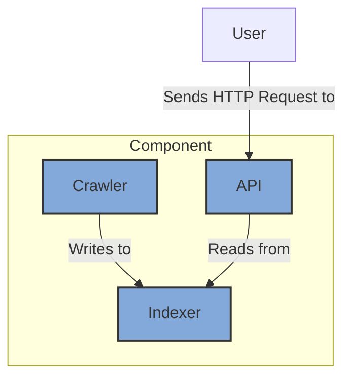
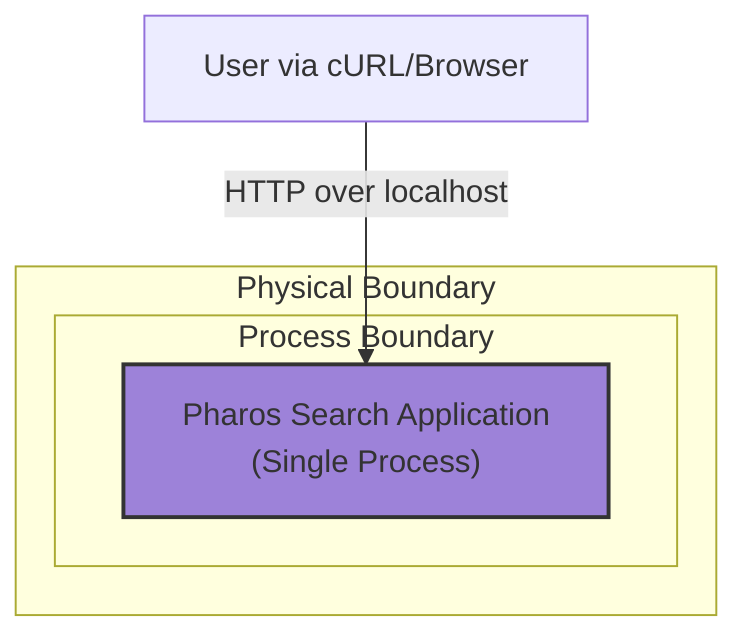

### **Establish a Monolithic Application Core**

*   **Problem:** To begin the project, we need a foundational software structure that allows for rapid, end-to-end development of the core `crawl -> index -> search` logic. A distributed system at this stage would introduce prohibitive complexity (networking, service discovery, deployment) and slow down initial progress.

*   **Solution:** Design a single, monolithic application that contains all the core logic in distinct, well-encapsulated modules. This "walking skeleton" will be a fully functional, albeit simplistic, version of the final system. The logical separation of modules within the monolith will serve as the blueprint for future microservices.

*   **Trade-offs:**

    *   **Pros:**

        *   **Maximum Development Speed:** Eliminates all infrastructure and networking overhead, allowing developers to focus solely on the core application logic.
        *   **Simplified Debugging:** A single process is trivial to run and debug on a local machine.
        *   **Establishes Clear Contracts:** Forces the definition of clear boundaries and interfaces between the logical components (Crawler, Indexer, API) early in the process.

    *   **Cons:**

        *   **Not Scalable:** This design is intentionally not scalable and is not intended for production use.
        *   **Tightly Coupled:** All modules share the same memory and compute resources, meaning a failure in one can bring down the entire application.

---

### **Design the Architecture-as-Code (AaC)**

#### **Logical View (C4 Component Diagram)**

This diagram shows the primary logical components of the monolith and their in-memory interactions.

---

#### **Physical View (Deployment Diagram)**

This diagram shows how the monolithic application will be deployed in a simple, local development environment.

---

#### **Component-to-Resource Mapping Table**

This table explicitly links the logical components to their physical implementation and justifies the technology choices for this initial phase.

| Logical Component            | Physical Resource / Technology             | Rationale                                                                                                                                                             |
| ---------------------------- | ------------------------------------------ | --------------------------------------------------------------------------------------------------------------------------------------------------------------------- |
| **Crawler** (Module)         | Part of the Monolithic Application Process | Simplicity. At this stage, there is no need for a separate process or container. The crawler is just a set of functions/classes within the single application.           |
| **Indexer** (Module)         | Part of the Monolithic Application Process | Simplicity and Performance. An in-memory data structure (e.g., a hash map) is the fastest and easiest way to implement the index for this non-persistent, MVP phase.   |
| **API** (Module)             | Part of the Monolithic Application Process | Simplicity. A standard library HTTP server embedded within the application is sufficient and avoids the complexity of a separate web server or API gateway.               |
| **Application Runtime**      | Docker Container                           | **Container-First Principle.** Encapsulating the monolith in a container from day one ensures a reproducible build and runtime environment, simplifying the transition to distributed deployment in later phases. |
