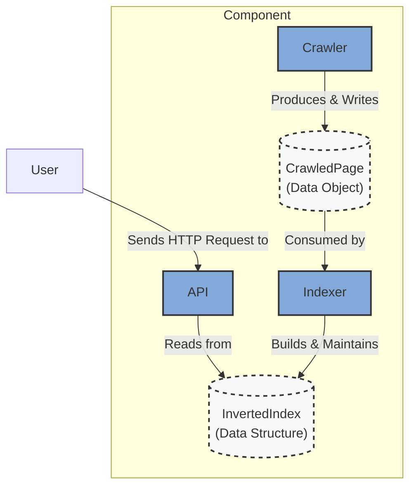
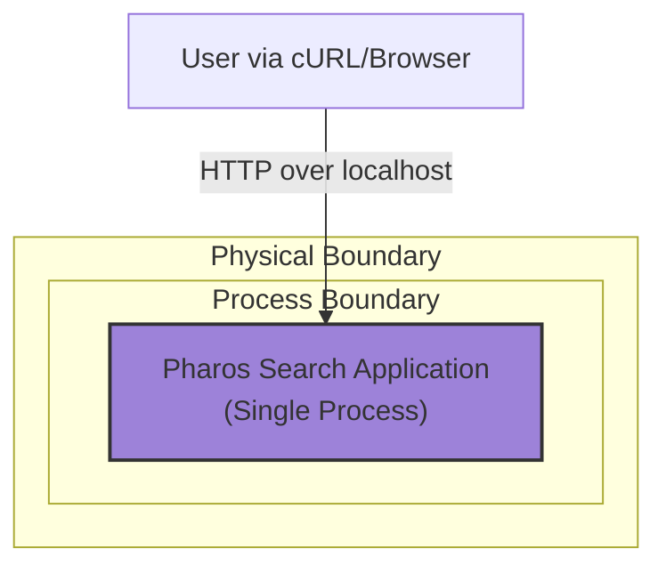

### **Define an In-Memory Data Flow**

*   **Problem:** The components within the monolith (`Crawler`, `Indexer`, `API`) need well-defined data structures and interfaces to communicate effectively. While `ARCH-001` established the components, it did not specify *what* data they pass between each other. Without these formal in-memory contracts, the implementation would be ambiguous.

*   **Solution:** Formalize the in-memory data flow by defining the key data structures that will be passed between components. The `Crawler` will produce a `CrawledPage` data object. The `Indexer` will consume this object to build and maintain an `InvertedIndex` data structure. The `API` will read from this `InvertedIndex`. This creates clear, testable interfaces for each module.

*   **Trade-offs:**
    *   **Pros:**
        *   **High Performance:** Direct memory access between components is the fastest possible method of data transfer, with zero I/O or network latency.
        *   **Simplified Logic:** Avoids the complexity of serialization/deserialization and error handling associated with network calls or database writes.
        *   **Clear Contracts:** Creates strong, compile-time contracts between modules, improving code quality and testability.
    *   **Cons:**
        *   **Ephemeral Data:** All data, including the index, is lost when the application is shut down.
        *   **Not Scalable:** All data structures must fit within the RAM of a single machine.
        *   **Tight Coupling:** The components are tightly coupled to the specific implementation of these in-memory data structures.

---

### **Design the Architecture-as-Code (AaC)**

#### **Logical View (C4 Component Diagram)**

This diagram refines the previous view by explicitly showing the data structures that mediate the interactions between the components.

---

#### **Physical View (Deployment Diagram)**

This architectural change is purely logical. The physical deployment model remains the same as in the previous issue: a single containerized process.

---

#### **Component-to-Resource Mapping Table**

The mapping remains largely the same, but with added detail on the in-memory data structures.

| Logical Component            | Physical Resource / Technology                          | Rationale                                                                                                                                                             |
| ---------------------------- | ------------------------------------------------------- | --------------------------------------------------------------------------------------------------------------------------------------------------------------------- |
| **Crawler** (Module)         | Part of the Monolithic Application Process              | Simplicity. At this stage, there is no need for a separate process or container. The crawler is just a set of functions/classes within the single application.           |
| **Indexer** (Module)         | Part of the Monolithic Application Process              | Simplicity and Performance. An in-memory data structure (e.g., a hash map) is the fastest and easiest way to implement the index for this non-persistent, MVP phase.   |
| **API** (Module)             | Part of the Monolithic Application Process              | Simplicity. A standard library HTTP server embedded within the application is sufficient and avoids the complexity of a separate web server or API gateway.               |
| **CrawledPage** (Data)       | In-Memory Struct / Class Object                         | Performance. Passing data via object references in memory is instantaneous and avoids any I/O overhead.                                                               |
| **InvertedIndex** (Data)     | In-Memory Hash Map / Dictionary                         | Performance & Suitability. A hash map is the ideal data structure for an inverted index, providing O(1) average time complexity for lookups.                               |
| **Application Runtime**      | Docker Container                                        | **Container-First Principle.** Encapsulating the monolith in a container ensures a reproducible build and runtime environment, simplifying future deployment.        |
