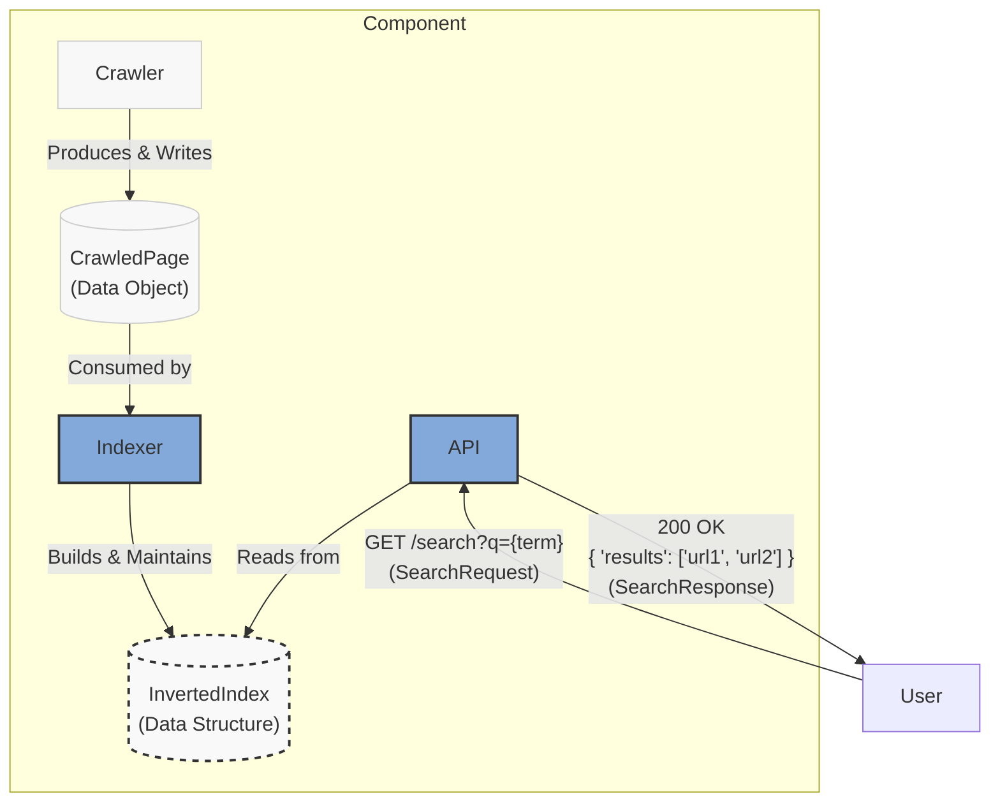
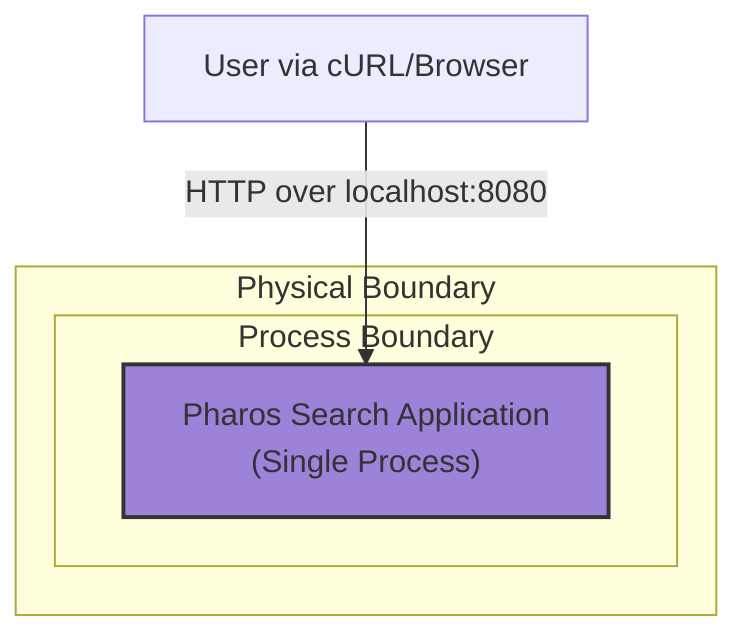

### **Expose Core Functionality via a Rudimentary API**

*   **Problem:** The system currently has no external interface. To complete the "walking skeleton," we need a way for a user or client to submit a search query and receive results. This external contract is the final piece required to validate the end-to-end functionality of the monolith.

*   **Solution:** Define and implement a single, stateless, unauthenticated HTTP GET endpoint. This endpoint will accept a search term as a URL query parameter, use the `API` module to query the in-memory index, and return a list of document identifiers (e.g., the URLs of the crawled pages) in a simple JSON format.

*   **Trade-offs:**
    *   **Pros:**
        *   **Completes the E2E Loop:** Provides the final, critical piece to make the system functional from user input to system output.
        *   **Technology Agnostic:** A simple HTTP/JSON API is a universal standard, allowing any type of client (a browser, cURL, another service) to interact with the system.
        *   **Defines the External Contract:** Establishes a basic but clear contract for how the search engine will be queried, which can be versioned and evolved later.
    *   **Cons:**
        *   **Insecure:** The endpoint will be unauthenticated and unencrypted (HTTP), making it unsuitable for anything beyond local development.
        *   **Simplistic:** Lacks features of a production API, such as error handling standards, pagination, and rate limiting.

---

### **Design the Architecture-as-Code (AaC)**

#### **Logical View (C4 Component Diagram)**

This diagram details the API component's external contract, specifying the endpoint and the request/response data structures.

---

#### **Physical View (Deployment Diagram)**

This architectural change is a refinement of the logical contract and does not alter the physical deployment model. The view remains the same.

---

#### **Component-to-Resource Mapping Table**

The table is updated to reflect the specific API technology choice.

| Logical Component            | Physical Resource / Technology                          | Rationale                                                                                                                                                             |
| ---------------------------- | ------------------------------------------------------- | --------------------------------------------------------------------------------------------------------------------------------------------------------------------- |
| **Crawler** (Module)         | Part of the Monolithic Application Process              | Simplicity. At this stage, there is no need for a separate process or container.                                                                                      |
| **Indexer** (Module)         | Part of the Monolithic Application Process              | Simplicity and Performance. An in-memory data structure is the fastest and easiest way to implement the index for this phase.                                         |
| **API** (Module)             | **Embedded HTTP Server** (e.g., Go's `net/http`, Express.js) | Simplicity and Self-Contained. Using a standard library web server avoids external dependencies (like Nginx or Apache) and keeps the application as a single, easy-to-run process. |
| **CrawledPage** (Data)       | In-Memory Struct / Class Object                         | Performance. Passing data via object references in memory is instantaneous.                                                                                           |
| **InvertedIndex** (Data)     | In-Memory Hash Map / Dictionary                         | Performance & Suitability. A hash map provides O(1) average time complexity for lookups, which is ideal for an index.                                                   |
| **Application Runtime**      | Docker Container                                        | **Container-First Principle.** Encapsulating the monolith in a container ensures a reproducible build and runtime environment, simplifying future deployment.        |
