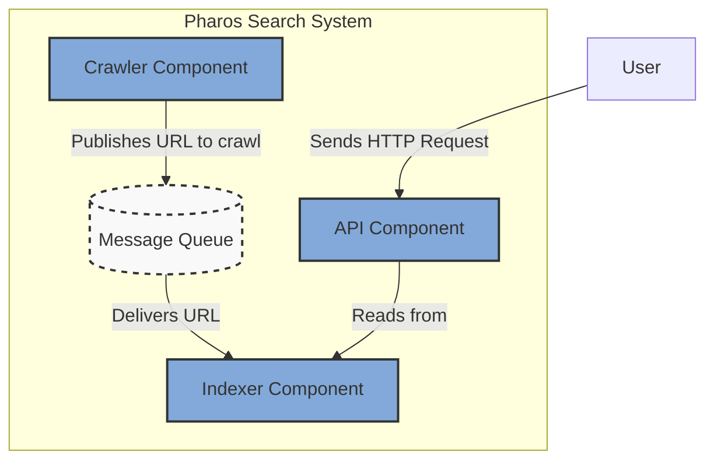
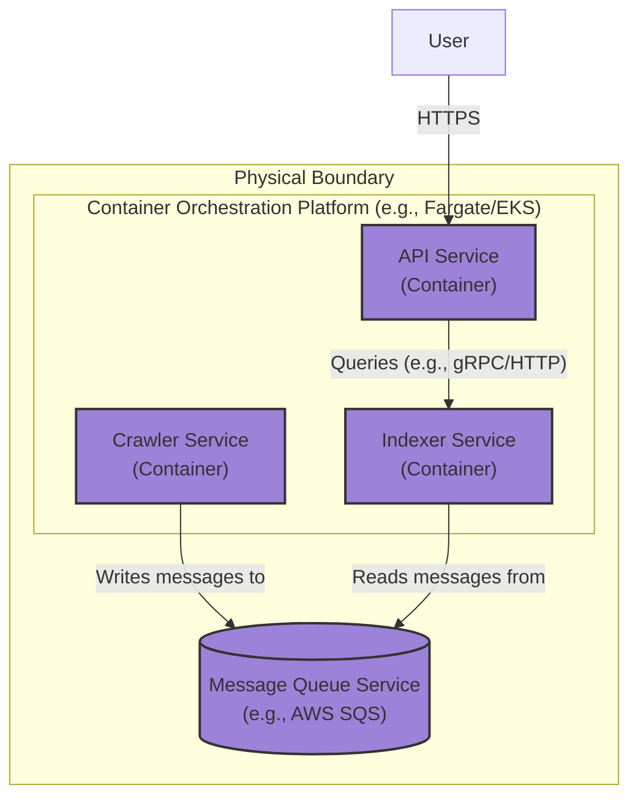

### **Introduce an Asynchronous Message Bus for Decoupling**

*   **Problem:** The monolithic architecture has served its purpose but is fundamentally unscalable. The direct, synchronous, in-memory call from the `Crawler` to the `Indexer` is a critical bottleneck. It prevents independent scaling, creates a single point of failure, and tightly couples the logic of fetching content with the logic of indexing it.

*   **Solution:** Dismantle the monolith by physically separating the `Crawler` and `Indexer` into independent services. Introduce a **Message Queue** as the asynchronous communication layer between them. The `Crawler` will now be a message *producer*, publishing a message for each successfully crawled page. The `Indexer` will be a message *consumer*, processing pages from the queue at its own pace.

*   **Trade-offs:**
    *   **Pros:**
        *   **Scalability:** The `Crawler` and `Indexer` services can now be scaled independently by running multiple instances of each.
        *   **Resilience:** The queue acts as a durable buffer. If the `Indexer` service is down, crawl data will accumulate safely in the queue and be processed when the service recovers.
        *   **Asynchronous Processing:** The `Crawler` no longer has to wait for a page to be indexed, freeing it up to crawl more pages, thus increasing throughput.
    *   **Cons:**
        *   **Increased Operational Complexity:** We are introducing a new, critical infrastructure component (the message bus) that must be deployed, monitored, and managed.
        *   **Increased Latency:** Message transport introduces a small amount of latency compared to direct in-memory calls.
        *   **New Failure Modes:** The system must now handle scenarios like poison pill messages (messages that repeatedly fail to be processed) and potential message bus outages.

---

### **Design the Architecture-as-Code (AaC)**

#### **Logical View (C4 Component Diagram)**

This diagram shows the new, decoupled architecture. The `Crawler` and `Indexer` are now distinct components that communicate indirectly via the `Message Queue`.

---

#### **Physical View (Deployment Diagram)**

This diagram illustrates the first distributed deployment of the system, showing separate services running in a containerized environment and using a managed cloud service for the message queue.

---

#### **Component-to-Resource Mapping Table**

This table reflects the significant architectural shift to a distributed, cloud-native design.

| Logical Component            | Physical Resource / Technology                          | Rationale                                                                                                                                                             |
| ---------------------------- | ------------------------------------------------------- | --------------------------------------------------------------------------------------------------------------------------------------------------------------------- |
| **Crawler** (Component)      | **Crawler Service** (Container on Fargate/EKS)          | Decoupling for independent scaling. A containerized service allows us to run many crawlers in parallel to increase fetch throughput.                                |
| **Indexer** (Component)      | **Indexer Service** (Container on Fargate/EKS)          | Decoupling for independent scaling and resilience. The indexer can now be scaled based on processing load, separate from the crawling or API load.                |
| **API** (Component)          | **API Service** (Container on Fargate/EKS)              | Decoupling for independent scaling. The API can be scaled based on user traffic without impacting the backend crawling and indexing processes.                         |
| **Message Queue**            | **AWS SQS (Standard Queue)**                            | **Managed & Reliable.** SQS is a fully managed, highly scalable, and cost-effective service that is purpose-built for decoupling services. It removes the operational burden of managing our own queueing system like RabbitMQ. |
| **Index Data**               | *Still In-Memory* within the Indexer Service            | **Incremental Change.** For this issue, we focus on decoupling the *processes*. The index remains in-memory. Persistence will be addressed in a subsequent issue (`ARCH-006`). |
