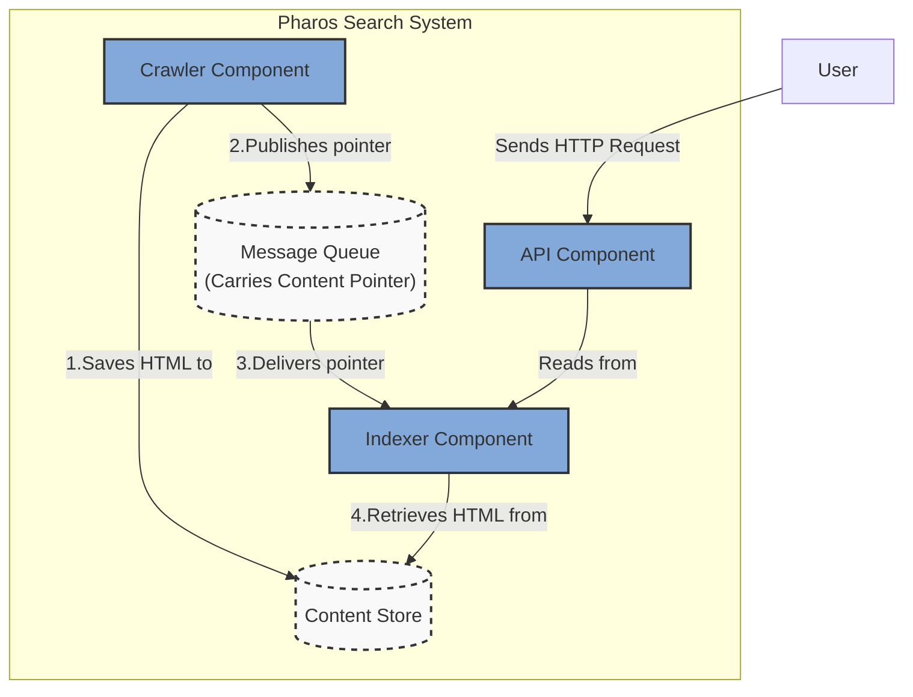
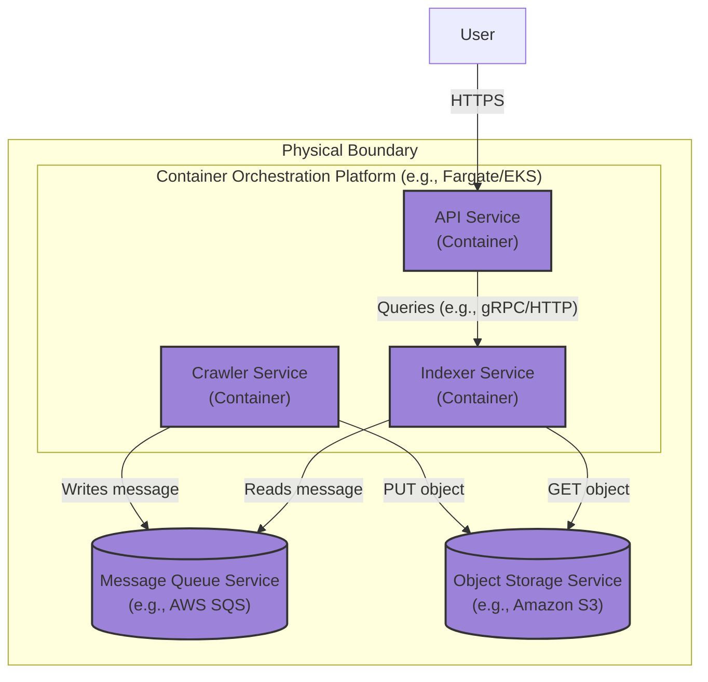

### **Establish a Centralized, Durable Content Store**

*   **Problem:** The current architecture passes data between services via a message queue. This is inefficient and unscalable for large payloads like full HTML web pages. Message queues have strict size limits (e.g., 256KB for AWS SQS) and are not designed for data persistence. This creates a critical architectural flaw: we have no permanent record of the content we crawl.

*   **Solution:** Introduce a highly durable **Object Store** to serve as the system's central content repository. The Crawler will now follow the "Claim Check" pattern:
    1.  Fetch the raw HTML content from a web page.
    2.  Save this content as an object in the central Object Store.
    3.  Publish a lightweight message to the queue containing only a **pointer** (e.g., the object's URI/key) to the stored content.
    The Indexer then consumes this pointer, retrieves the full content from the Object Store, and proceeds with processing.

*   **Trade-offs:**
    *   **Pros:**
        *   **Handles Arbitrary Data Size:** The system can now process web pages of any size, completely removing the message size constraint.
        *   **Creates a Durable Data Lake:** We now have a permanent, canonical source of truth for all crawled data. This is invaluable for reprocessing, disaster recovery, auditing, and enabling future data analytics.
        *   **Decouples Data from Transport:** The message bus remains a lightweight and fast transport layer, while the Object Store handles the heavy lifting of data storage.
    *   **Cons:**
        *   **Increased Indexer Latency:** The Indexer service has an additional step and must make a network call to the Object Store to fetch content, slightly increasing the processing time per page.
        *   **Additional Infrastructure Cost:** Introduces a new managed service for storage, which incurs costs for storage and data transfer operations (GET/PUT requests).

---

### **Design the Architecture-as-Code (AaC)**

#### **Logical View (C4 Component Diagram)**

This diagram introduces the `Content Store` as a new core component. The data flowing through the `Message Queue` is now a `Content Pointer`.

---

#### **Physical View (Deployment Diagram)**

The physical view is updated to include the new Object Storage Service and shows the interactions from the containerized services.

---

#### **Component-to-Resource Mapping Table**

The table is updated to include the new `Content Store` component and its physical mapping.

| Logical Component            | Physical Resource / Technology                          | Rationale                                                                                                                                                             |
| ---------------------------- | ------------------------------------------------------- | --------------------------------------------------------------------------------------------------------------------------------------------------------------------- |
| **Crawler** (Component)      | **Crawler Service** (Container on Fargate/EKS)          | Decoupled service that can be scaled horizontally to maximize crawl throughput.                                                                                       |
| **Indexer** (Component)      | **Indexer Service** (Container on Fargate/EKS)          | Decoupled service that can be scaled based on the volume of content that needs to be processed.                                                                       |
| **API** (Component)          | **API Service** (Container on Fargate/EKS)              | Decoupled service that can be scaled independently based on user query traffic.                                                                                       |
| **Message Queue**            | **AWS SQS (Standard Queue)**                            | Managed, scalable, and reliable queue for transporting lightweight message pointers, fully decoupling the producer and consumer services.                         |
| **Content Store**            | **Amazon S3**                                           | **Industry Standard.** S3 provides virtually unlimited scalability, 11 nines of durability, and low cost. It is the ideal managed service for a raw data lake/content repository. |
| **Index Data**               | *Still In-Memory* within the Indexer Service            | **Incremental Change.** Persistence for the index itself is a separate architectural problem that will be addressed in the future issue (`ARCH-006`).                   |
