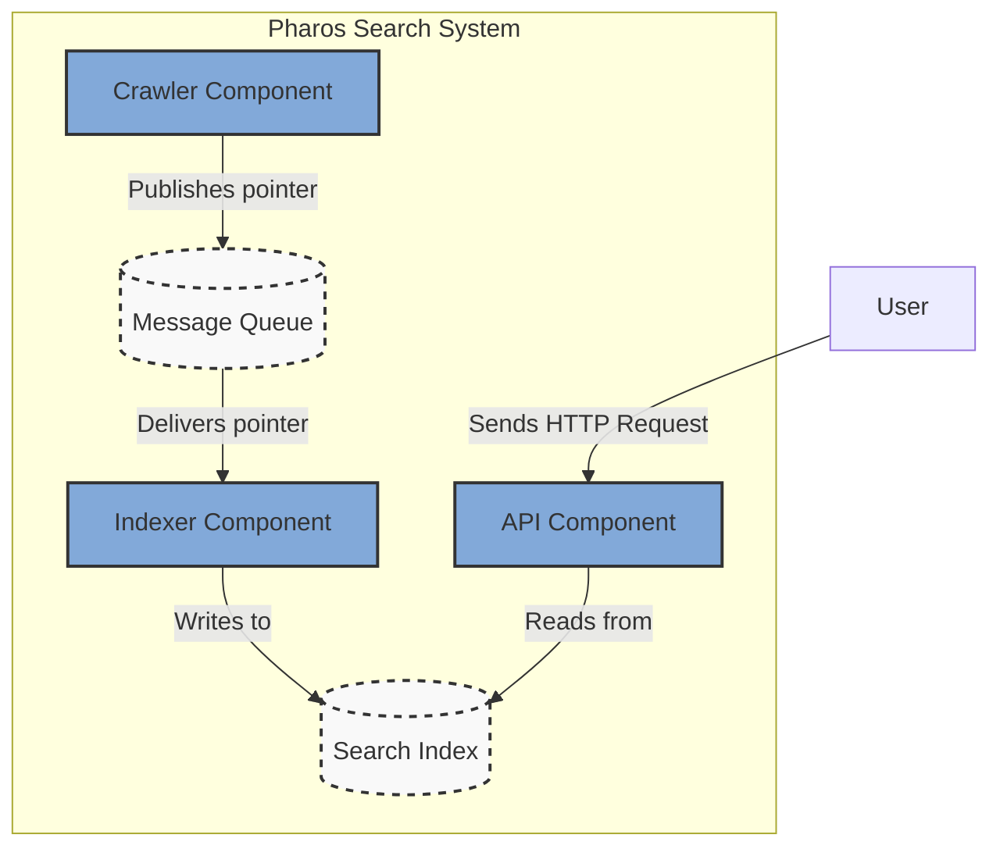
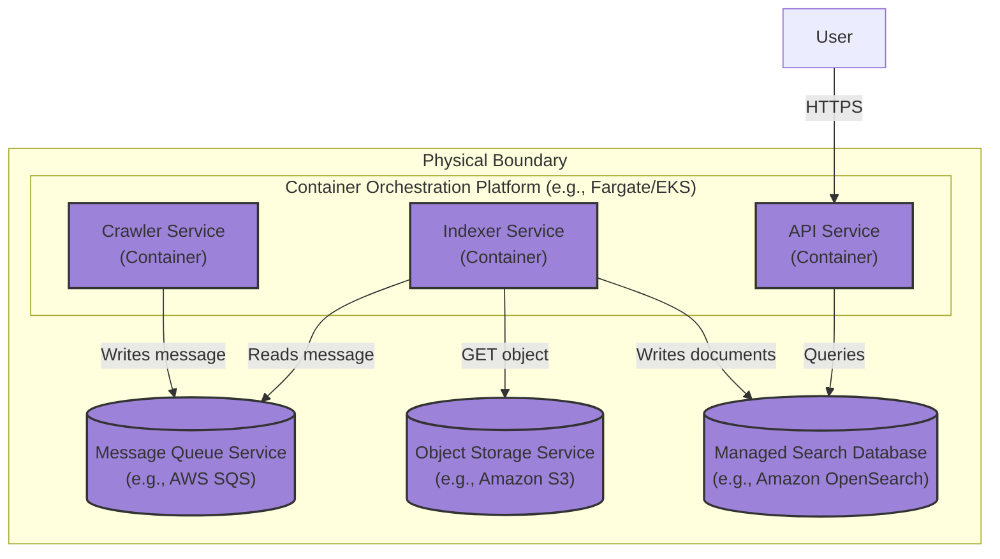

### **Evolve the Index into a Persistent, Sharded Data Store**

*   **Problem:** The system's search index is still an ephemeral, in-memory data structure residing within the `Indexer Service`. This is the last major single point of failure and scalability bottleneck from the original monolith. If an `Indexer` instance crashes, all its indexed data is lost. Furthermore, the total size of the search index is limited by the RAM of a single container, making it impossible to scale to the required 10 billion pages.

*   **Solution:** Replace the in-memory index with an external, managed **Search Database** that is persistent, sharded, and highly available by default.
    1.  The `Indexer Service`'s responsibility is now simplified to a pure ETL (Extract, Transform, Load) role: it consumes messages, retrieves content, and writes the processed data into the external Search Database.
    2.  The `API Service`'s responsibility changes: instead of querying the `Indexer Service`, it now queries the Search Database directly to serve user requests.

*   **Trade-offs:**
    *   **Pros:**
        *   **Data Durability & High Availability:** The index is now safely persisted and can survive service restarts or hardware failures. Managed services typically handle replication automatically.
        *   **Massive Scalability:** The index can now grow far beyond the memory of a single machine by adding more shards to the database cluster.
        *   **Decouples Reads from Writes:** User query traffic (`read`) is now completely isolated from the indexing workload (`write`), preventing one from impacting the other.
    *   **Cons:**
        *   **Increased Latency:** Both reads and writes now incur network latency to the database, which is inherently slower than in-memory operations. (This will be mitigated with caching in a later phase).
        *   **Significant Cost Increase:** A managed, scalable search database is a major cost center for the project.
        *   **Adds a "Hot Path" Dependency:** The API's ability to serve requests is now directly dependent on the availability and performance of this new database.

---

### **Design the Architecture-as-Code (AaC)**

#### **Logical View (C4 Component Diagram)**

This diagram shows the final decoupling. The `Indexer` and `API` components no longer communicate directly. They are now both clients of the new `Search Index` component.

---

#### **Physical View (Deployment Diagram)**

The physical view is updated to include the managed Search Database Service. This completes the core distributed architecture.

---

#### **Component-to-Resource Mapping Table**

The table is updated to reflect the final component of our distributed foundation.

| Logical Component            | Physical Resource / Technology                          | Rationale                                                                                                                                                             |
| ---------------------------- | ------------------------------------------------------- | --------------------------------------------------------------------------------------------------------------------------------------------------------------------- |
| **Crawler** (Component)      | **Crawler Service** (Container on Fargate/EKS)          | Decoupled service that can be scaled horizontally to maximize crawl throughput.                                                                                       |
| **Indexer** (Component)      | **Indexer Service** (Container on Fargate/EKS)          | A pure, stateless ETL service. Scales based on the volume of content that needs to be processed and loaded into the search database.                                  |
| **API** (Component)          | **API Service** (Container on Fargate/EKS)              | A stateless query service. Scales based on user query traffic.                                                                                                        |
| **Message Queue**            | **AWS SQS (Standard Queue)**                            | Managed, scalable, and reliable queue for transporting lightweight message pointers.                                                                                  |
| **Content Store**            | **Amazon S3**                                           | Managed, durable, and cost-effective object storage, serving as the system's raw data lake.                                                                           |
| **Search Index**             | **Amazon OpenSearch Service**                           | **Managed & Purpose-Built.** OpenSearch is a fully managed service designed specifically for search and indexing at scale. It provides sharding, replication, and a powerful query DSL out-of-the-box, saving immense operational and development effort. |
