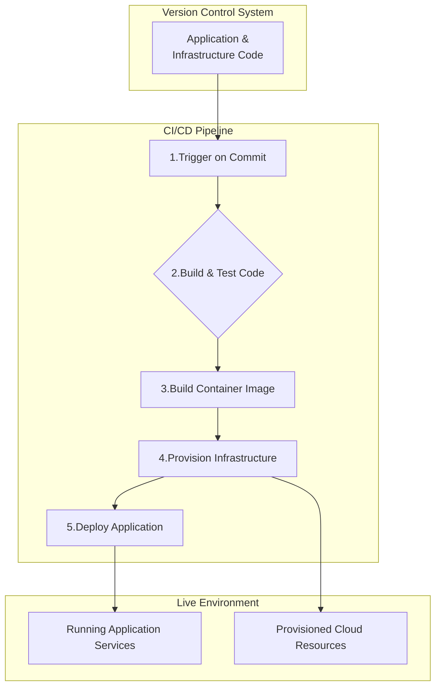
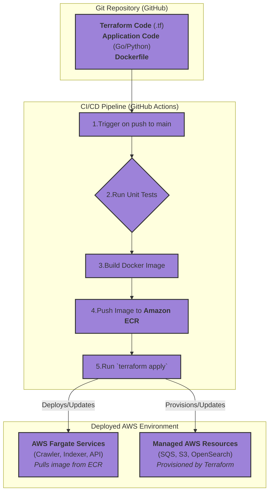

### **Define the Infrastructure-as-Code (IaC) and Containerization Strategy**

*   **Problem:** The architecture now consists of multiple containerized services and managed cloud resources. Provisioning, configuring, and deploying this complex topology manually (e.g., via a cloud console) is not repeatable, is prone to human error, and leads to "configuration drift" where environments become inconsistent. We lack a formal, version-controlled process for managing our infrastructure and deployments.

*   **Solution:** Formally adopt a specific set of technologies and a defined workflow for managing the system's architecture as code.
    1.  **Containerization:** All services MUST be packaged as **Docker** images.
    2.  **Infrastructure-as-Code:** All cloud resources (queues, databases, storage, container platforms) MUST be defined using **Terraform**.
    3.  **CI/CD Workflow:** A continuous integration and deployment pipeline will be established. A push to the main branch will trigger automated builds of Docker images and the application of Terraform plans to deploy changes.
    The definitions for all of these components (Dockerfiles, Terraform scripts, CI/CD pipeline configurations) will be stored in the project's Git repository.

*   **Trade-offs:**
    *   **Pros:**
        *   **Repeatability & Consistency:** Guarantees that development, staging, and production environments can be created identically.
        *   **Version Control for Infrastructure:** All changes to the architecture are now auditable, reviewable, and revertible through Git history.
        *   **Automation:** Drastically reduces the manual effort and risk associated with deployments and infrastructure changes.
        *   **Disaster Recovery:** Enables the entire system's infrastructure to be recreated from scratch quickly and reliably.
    *   **Cons:**
        *   **Initial Setup Overhead:** There is a significant upfront investment in writing the Terraform code and setting up the CI/CD pipeline.
        *   **Steeper Learning Curve:** The team must be proficient in Docker, Terraform, and the chosen CI/CD platform's syntax.
        *   **Increased Abstraction:** Can sometimes make debugging infrastructure issues more complex than interacting with the cloud console directly.

---

### **Design the Architecture-as-Code (AaC)**

As this issue defines a process and toolchain, the diagrams will represent a workflow rather than a static system architecture.

#### **Logical View (Conceptual CI/CD Workflow)**

This diagram shows the conceptual flow from code commit to a deployed, running system, without specifying any particular technology.

---

#### **Physical View (Specific Technology CI/CD Workflow)**

This diagram maps the conceptual workflow to our chosen technology stack.

---

#### **Component-to-Resource Mapping Table**

This table maps the conceptual roles of our workflow to the specific technologies chosen.

| Conceptual Role              | Physical Resource / Technology             | Rationale                                                                                                                                                             |
| ---------------------------- | ------------------------------------------ | --------------------------------------------------------------------------------------------------------------------------------------------------------------------- |
| **Version Control System**   | **Git (hosted on GitHub)**                 | The de-facto industry standard for version control. GitHub provides excellent integration for CI/CD, issue tracking, and code reviews.                                  |
| **Containerization Format**  | **Docker**                                 | The universal standard for container images, ensuring portability and a vast ecosystem of tools and base images.                                                      |
| **Container Registry**       | **Amazon ECR (Elastic Container Registry)**| A secure, highly-available, and managed container registry. It integrates seamlessly with AWS deployment targets like Fargate, providing a simple and robust permission model. |
| **Infrastructure-as-Code**   | **Terraform**                              | The leading cloud-agnostic IaC tool. Its declarative syntax, state management, and strong community make it ideal for managing complex cloud architectures robustly.      |
| **CI/CD Platform**           | **GitHub Actions**                         | Tightly integrated with our source code repository. It is a managed, event-driven CI/CD platform that is simple to configure (as code) and powerful enough for our needs. |
| **Container Orchestration**  | **AWS Fargate**                            | A serverless compute engine for containers. It allows us to run our services without managing the underlying EC2 instances, reducing operational overhead significantly.     |
