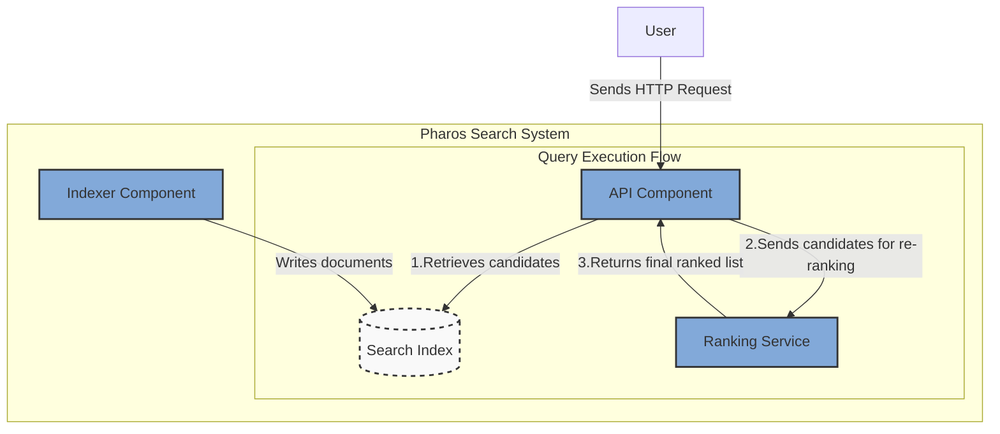
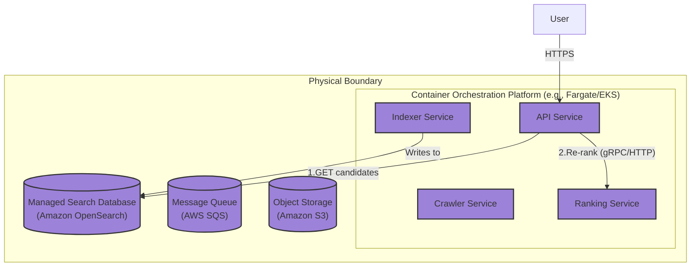

### **Introduce a Pluggable Ranking and Relevancy Subsystem**

*   **Problem:** The current architecture relies solely on the default ranking mechanism of the underlying search database (e.g., OpenSearch's default BM25 score). This is a "black box" that is difficult to customize and prevents us from incorporating multiple business-critical signals (like link authority, content freshness, or user location) into the final result order. This severely limits our ability to improve search quality.

*   **Solution:** Introduce a new, dedicated **Ranking Service**. This changes the query execution flow into a two-stage "retrieve and re-rank" pattern:
    1.  The `API Service` performs an initial, broad query against the `Search Index` to retrieve a large set of candidate documents (e.g., the top 500 results).
    2.  The `API Service` then passes this candidate set to the new `Ranking Service`, which applies a more sophisticated, pluggable scoring model to re-rank the candidates and produce the final, high-quality result list that is returned to the user.

*   **Trade-offs:**
    *   **Pros:**
        *   **Decoupled Ranking Logic:** Enables data scientists and engineers to iterate on and A/B test different ranking models without any changes to the core search index.
        *   **Enhanced Relevance:** Allows for the combination of multiple ranking signals (text score from the index, PageRank, freshness scores, etc.) to produce a superior final ranking.
        *   **Optimized Performance:** Uses a "funnel" approach. The initial retrieval from the database is kept fast and simple, while the more computationally expensive ranking logic is only applied to a smaller, pre-filtered set of results.
    *   **Cons:**
        *   **Increased Query Latency:** Introduces an additional network hop and computational step into the critical path of serving a user query. This will need to be carefully monitored and optimized.
        *   **Increased Complexity:** Adds a new stateful or stateless service to the critical query path, which must be highly available and performant.
        *   **Data Fan-Out:** The `Ranking Service` may need to fetch additional data from other sources (e.g., a PageRank database) to perform its calculations, adding further dependencies.

---

### **Design the Architecture-as-Code (AaC)**

#### **Logical View (C4 Component Diagram)**

This diagram introduces the `Ranking Service` and shows the new two-step interaction orchestrated by the `API` component.

---

#### **Physical View (Deployment Diagram)**

The physical view is updated to include the new `Ranking Service` container.

---

#### **Component-to-Resource Mapping Table**

The table is updated to include the new `Ranking Service`.

| Logical Component            | Physical Resource / Technology                          | Rationale                                                                                                                                                             |
| ---------------------------- | ------------------------------------------------------- | --------------------------------------------------------------------------------------------------------------------------------------------------------------------- |
| **Crawler** (Component)      | **Crawler Service** (Container on Fargate/EKS)          | Decoupled service for maximizing crawl throughput.                                                                                                                    |
| **Indexer** (Component)      | **Indexer Service** (Container on Fargate/EKS)          | Stateless ETL service that loads data into the search database.                                                                                                       |
| **API** (Component)          | **API Service** (Container on Fargate/EKS)              | Orchestrates the query flow, acting as the client for both the search database and the new ranking service.                                                           |
| **Ranking Service**          | **Ranking Service** (Container on Fargate/EKS)          | A dedicated, stateless compute service. Can be scaled independently based on the complexity of ranking algorithms and query load. Allows for specialized runtimes (e.g., Python for ML models). |
| **Message Queue**            | **AWS SQS (Standard Queue)**                            | Managed, reliable queue for the data ingestion path.                                                                                                                  |
| **Content Store**            | **Amazon S3**                                           | Managed, durable object storage for the raw data lake.                                                                                                                |
| **Search Index**             | **Amazon OpenSearch Service**                           | A managed, scalable database, now optimized and used primarily for fast candidate retrieval (recall) rather than final precision ranking.                             |
