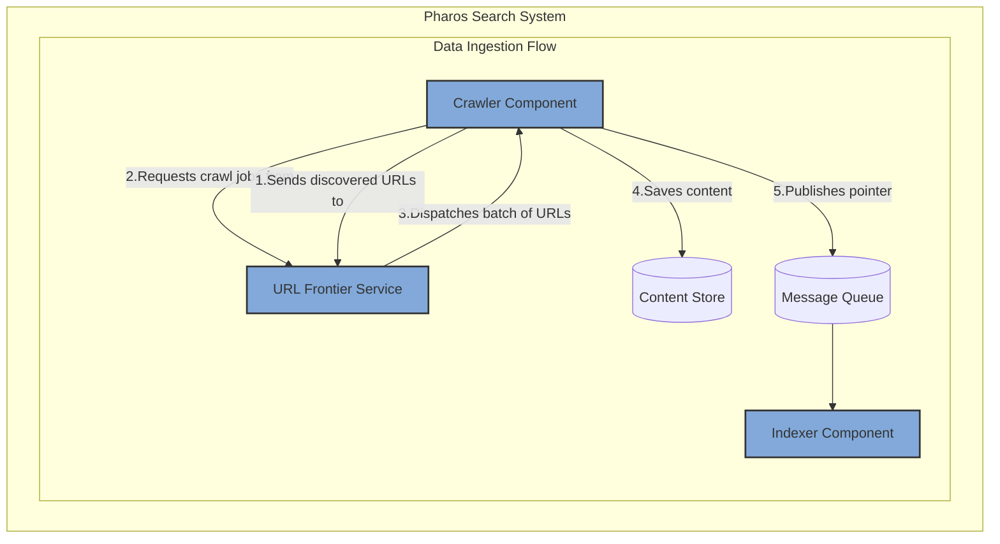
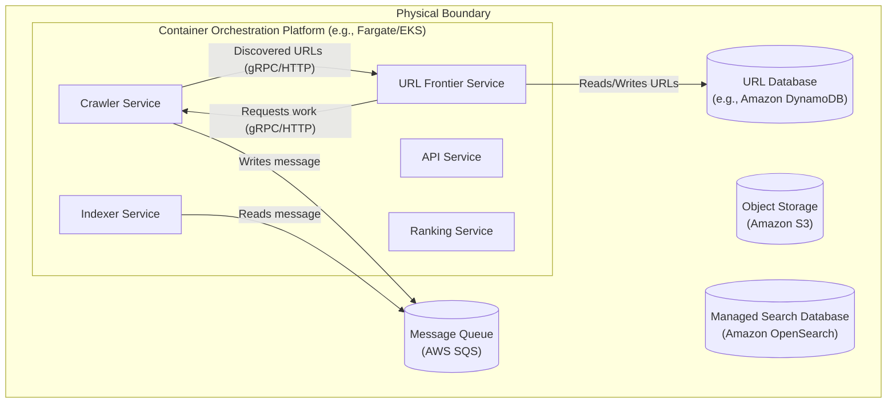

### **Formalize the URL Frontier as a Dedicated Service**

*   **Problem:** The current `Crawler Service` is simple and stateless, pulling work from a basic queue. This architecture lacks the intelligence to crawl the web efficiently. It cannot prioritize important pages, enforce "politeness" rules (i.e., not overwhelming a single web server), manage recrawl schedules based on update frequency, or de-duplicate newly discovered URLs at a massive scale.

*   **Solution:** Extract all crawl scheduling logic into a new, dedicated, stateful **URL Frontier Service**. This service becomes the central brain of the crawling operation.
    1.  When a `Crawler` service processes a page, it extracts all links and sends them as a "discovered URLs" batch to the `URL Frontier`.
    2.  The `URL Frontier Service` is responsible for storing, de-duplicating, prioritizing, and scheduling these URLs. It maintains a persistent database of all URLs.
    3.  Instead of reading from a simple queue, `Crawler` instances now actively request a "batch of work" (a list of URLs to crawl) directly from the `URL Frontier Service`, which dispenses them according to its internal scheduling and politeness logic.

*   **Trade-offs:**
    *   **Pros:**
        *   **Intelligent & Efficient Crawling:** Enables sophisticated prioritization (e.g., crawling important sites more frequently), dramatically improving index freshness and relevance.
        *   **Centralized Politeness:** Makes the crawler a better web citizen by enforcing domain-specific rate limits from a central point.
        *   **Massive URL Scalability:** Provides a dedicated, persistent storage solution designed to handle and de-duplicate trillions of URLs.
    *   **Cons:**
        *   **New Stateful Component:** The `URL Frontier` is a complex, stateful service with a high-performance database, becoming a new critical dependency in the data ingestion pipeline.
        *   **Increased Crawl Latency:** The crawl loop now involves more network calls (Crawler -> Frontier -> Crawler), which can slightly increase the latency for crawling a single page.
        *   **"Hot Spot" Risk:** The Frontier's database can become a performance bottleneck if not designed and scaled correctly.

---

### **Design the Architecture-as-Code (AaC)**

#### **Logical View (C4 Component Diagram)**

This diagram introduces the `URL Frontier` as the new central scheduler, replacing the simple message queue for crawl jobs.

---

#### **Physical View (Deployment Diagram)**

The physical view is updated to include the new `URL Frontier Service` container and its dedicated `URL Database`.

---

#### **Component-to-Resource Mapping Table**

The table is updated to include the new `URL Frontier Service` and its database.

| Logical Component            | Physical Resource / Technology                          | Rationale                                                                                                                                                             |
| ---------------------------- | ------------------------------------------------------- | --------------------------------------------------------------------------------------------------------------------------------------------------------------------- |
| **Crawler** (Component)      | **Crawler Service** (Container on Fargate/EKS)          | Now a pure worker, decoupled from scheduling logic. Interacts with the Frontier service for work management.                                                          |
| **Indexer** (Component)      | **Indexer Service** (Container on Fargate/EKS)          | No changes. Continues its role as a stateless ETL service.                                                                                                            |
| **API** (Component)          | **API Service** (Container on Fargate/EKS)              | No changes. Continues to orchestrate the query flow.                                                                                                                  |
| **Ranking Service**          | **Ranking Service** (Container on Fargate/EKS)          | No changes. Continues to provide re-ranking logic.                                                                                                                    |
| **URL Frontier Service**     | **URL Frontier Service** (Container on Fargate/EKS)     | A new, stateful service that encapsulates all scheduling logic. Can be scaled independently to handle the load of managing URLs.                                    |
| **URL Database**             | **Amazon DynamoDB**                                     | **Massive Scalability & Performance.** DynamoDB is a managed key-value store that provides single-digit millisecond latency and virtually unlimited scale, which is essential for storing and querying billions of URLs by their hash. |
| **Other Managed Services**   | SQS, S3, OpenSearch                                     | No changes. These services continue to perform their established roles in the architecture.                                                                           |
