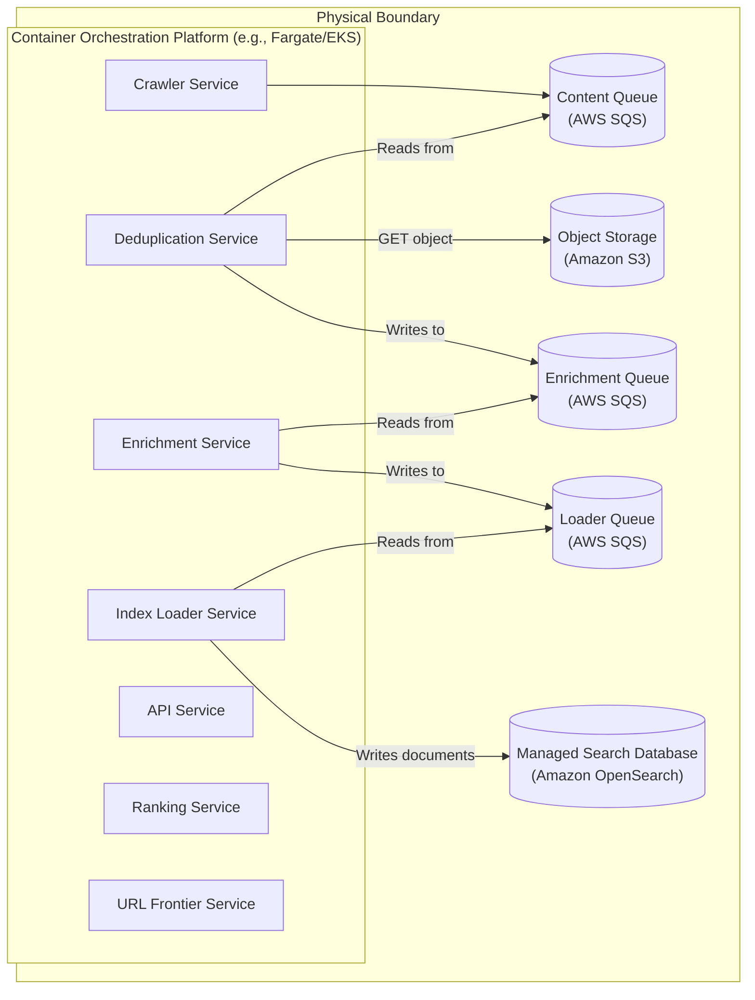

### **Establish a Data Processing Pipeline for Enrichment**

*   **Problem:** The current data flow from the `Content Store` to the `Search Index` is a single, monolithic step performed by the `Indexer Service`. This is rigid and makes it difficult to add new, valuable processing steps. We cannot easily integrate features like near-duplicate detection (Simhash), language identification, or named-entity recognition without making the `Indexer Service` increasingly complex and bloated.

*   **Solution:** Refactor the monolithic `Indexer Service` into a formal, multi-stage **Data Processing Pipeline**. This pipeline will be composed of smaller, specialized services connected by message queues.
    1.  The initial message from the `Crawler` (the content pointer) now triggers the first stage of this new pipeline.
    2.  Each stage performs a discrete task (e.g., Stage 1: Deduplication, Stage 2: Enrichment) and passes an enriched message to the next stage's queue.
    3.  The final stage is the `Loader Service`, which is responsible for writing the fully processed and enriched data to the `Search Index`.

*   **Trade-offs:**
    *   **Pros:**
        *   **Extensibility & Modularity:** New processing steps (e.g., a "Toxicity Scoring Service") can be inserted into the pipeline with zero changes to existing services.
        *   **Specialization:** Each service in the pipeline can be built with the best-suited technology for its task (e.g., using Python/PyTorch for an ML-based enrichment service).
        *   **Improved Resilience:** The pipeline is more fault-tolerant. A failure in one stage can be isolated and retried without impacting the entire indexing process.
    *   **Cons:**
        *   **Increased End-to-End Latency:** The overall time to index a document will increase due to the additional network hops and queueing delays between stages.
        *   **Increased Operational Complexity:** The system now has more microservices and message queues to deploy, manage, and monitor.
        *   **Complex Debugging:** Tracing a single document's journey through the multi-stage pipeline requires distributed tracing and careful correlation of logs.

---

### **Design the Architecture-as-Code (AaC)**

#### **Logical View (C4 Component Diagram)**

This diagram refactors the single `Indexer` component into a multi-stage pipeline, showing a flow through example processing stages.

```mermaid
graph TD
    subgraph Pharos Search System
        subgraph "Data Processing Pipeline"
            direction LR
            Deduplication[Deduplication Stage] --> Enrichment[Enrichment Stage]
            Enrichment --> Loader[Index Loader Stage]
        end

        %% Upstream Flow
        MessageQueue[("Initial Message Queue")] --"Delivers pointer"--> Deduplication

        %% Downstream
        Loader --"Writes enriched document"--> SearchIndex[("Search Index")]

        %% Other components for context
        Crawler --"Publishes pointer"--> MessageQueue
    end

    %% Component Descriptions
    classDef component fill:#82a9d9,stroke:#333,stroke-width:2px;
    class Deduplication,Enrichment,Loader,Crawler component;

    click Deduplication "https://g.co/expl/dF4e" "Component: Deduplication Stage\nResponsibility: Consumes the initial message. Retrieves content and calculates a hash (e.g., Simhash) to check for and filter out near-duplicates. Passes a unique content message to the next stage."
    click Enrichment "https://g.co/expl/eG5f" "Component: Enrichment Stage\nResponsibility: Performs NLP tasks like language identification, named-entity recognition, etc. Appends this metadata to the message and passes it on."
    click Loader "https://g.co/expl/lH6g" "Component: Index Loader Stage\nResponsibility: The final stage. Formats the fully enriched data and loads it into the Search Index."
```

---

#### **Physical View (Deployment Diagram)**

The physical view shows the `Indexer Service` being replaced by multiple, smaller containerized services, each with its own dedicated message queue.

---

#### **Component-to-Resource Mapping Table**

The table is updated to replace the single `Indexer` with the new pipeline stages.

| Logical Component            | Physical Resource / Technology                          | Rationale                                                                                                                                                             |
| ---------------------------- | ------------------------------------------------------- | --------------------------------------------------------------------------------------------------------------------------------------------------------------------- |
| **Deduplication Stage**      | **Deduplication Service** (Container on Fargate/EKS)    | A specialized, stateless service focused on a single task. Can be scaled independently based on the volume of incoming content.                                       |
| **Enrichment Stage**         | **Enrichment Service** (Container on Fargate/EKS)       | A specialized service that can be built with a specific tech stack (e.g., Python with ML libraries) without affecting other parts of the system.                   |
| **Index Loader Stage**       | **Index Loader Service** (Container on Fargate/EKS)     | A simple, final-stage service responsible only for data formatting and loading. Decouples processing logic from the specifics of the search database schema.          |
| **Pipeline Queues**          | **AWS SQS**                                             | SQS is ideal for connecting pipeline stages. Each queue acts as a durable, scalable buffer, making the entire pipeline resilient to failures in individual stages. |
| **Other Components**         | Crawler, API, Ranking, Frontier, S3, OpenSearch, DynamoDB | No changes. These components and services continue to perform their established roles in the architecture.                                                          |
