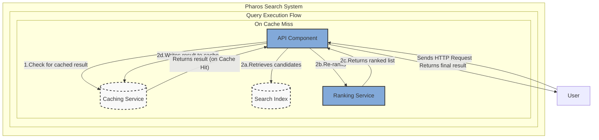
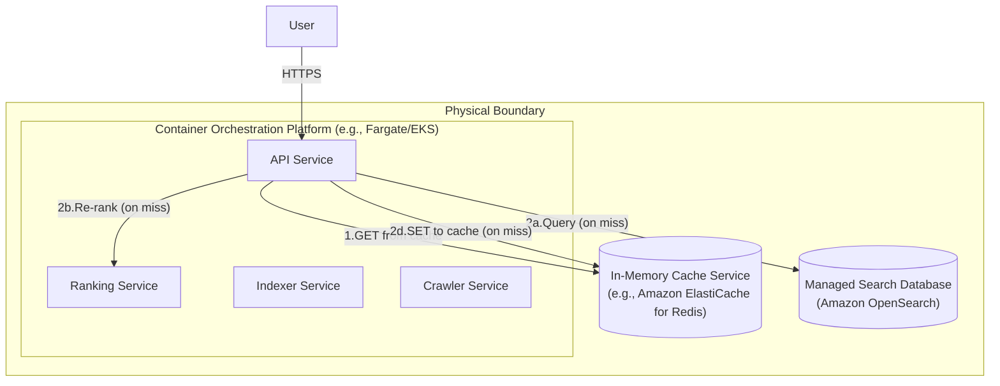

### **Integrate a Distributed Caching Layer**

*   **Problem:** The `API Service` queries the `Search Database` and `Ranking Service` for every user request. This direct dependency on "hot path" databases and compute services for every query creates two problems:
    1.  **Latency:** It does not provide the fastest possible response time, as it always incurs the full cost of database lookups and ranking computation.
    2.  **Scalability & Cost:** It puts significant, repetitive load on our most expensive backend components (the search database and ranking service), especially for popular or "viral" search queries.

*   **Solution:** Introduce a distributed, in-memory **Caching Service** as a high-speed buffer in the query path. The `API Service` will now follow a "cache-aside" pattern:
    1.  Upon receiving a user query, the `API Service` first checks if the result for this exact query exists in the `Caching Service`.
    2.  **Cache Hit:** If the result is found, it is returned directly to the user with minimal latency, bypassing the entire backend search and ranking flow.
    3.  **Cache Miss:** If the result is not found, the `API Service` proceeds with the normal flow (querying the `Search Index` and `Ranking Service`), and before returning the final result to the user, it writes that result into the `Caching Service` with a specific Time-to-Live (TTL).

*   **Trade-offs:**
    *   **Pros:**
        *   **Dramatically Reduced Latency:** For cached results, query response times will be in the single-digit milliseconds.
        *   **Reduced Backend Load:** Significantly reduces the number of queries hitting the core search database and ranking services, improving their performance and reducing operational costs.
        *   **Improved Scalability:** The system can absorb massive traffic spikes for popular queries by serving them directly from the highly scalable cache.
    *   **Cons:**
        *   **Data Staleness:** There is a possibility that users will see slightly stale (out-of-date) results from the cache until the TTL expires. This is a classic consistency vs. performance trade-off.
        *   **Increased Complexity:** The `API Service` logic becomes more complex, as it now needs to manage cache connections, keys, and the cache-aside pattern.
        *   **Additional Infrastructure:** Introduces a new, critical infrastructure component (the caching service) that must be managed and monitored.

---

### **Design the Architecture-as-Code (AaC)**

#### **Logical View (C4 Component Diagram)**

This diagram shows the new `Caching Service` and illustrates the cache-aside logic within the query execution flow.  

---

#### **Physical View (Deployment Diagram)**

The physical view is updated to include the new managed Caching Service.

---

#### **Component-to-Resource Mapping Table**

The table is updated to include the new `Caching Service`.

| Logical Component            | Physical Resource / Technology                          | Rationale                                                                                                                                                             |
| ---------------------------- | ------------------------------------------------------- | --------------------------------------------------------------------------------------------------------------------------------------------------------------------- |
| **API** (Component)          | **API Service** (Container on Fargate/EKS)              | Now a stateful-logic client, managing the cache-aside pattern. Still scales horizontally.                                                                             |
| **Caching Service**          | **Amazon ElastiCache for Redis**                        | **Industry Standard & High Performance.** ElastiCache provides a fully managed, highly available, and low-latency in-memory Redis cluster. It is purpose-built for this exact use case and removes significant operational burden. |
| **Ranking Service**          | **Ranking Service** (Container on Fargate/EKS)          | No changes. Continues its role as the re-ranking engine.                                                                                                              |
| **Search Index**             | **Amazon OpenSearch Service**                           | No changes. Continues its role as the candidate retrieval engine. Its load will be significantly reduced by the cache.                                                |
| **Other Components**         | Crawler, Pipeline Services, S3, SQS, DynamoDB           | No changes. The caching layer is an optimization for the read path and does not affect the data ingestion pipeline.                                                   |
