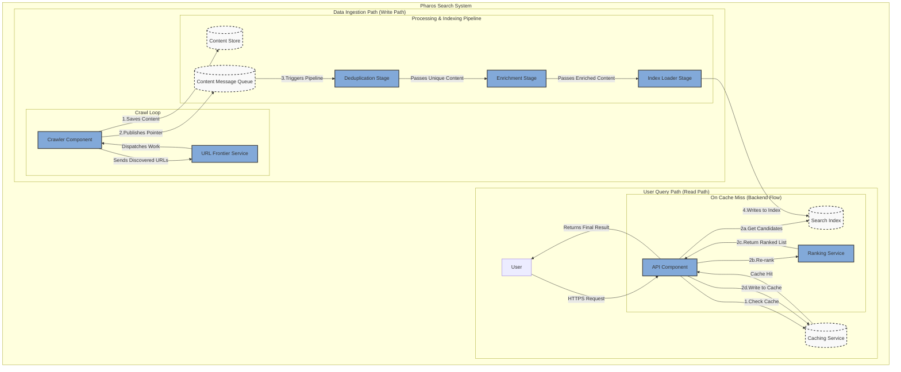
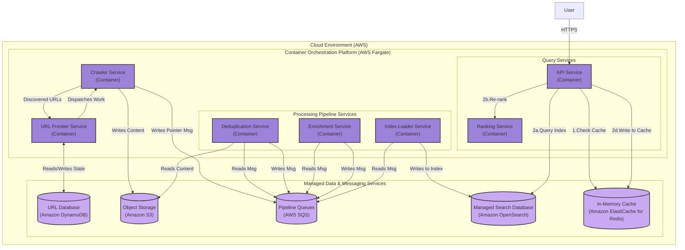

### Overall Logical View (C4 Component Diagram)

```mermaid
graph TD
    %% Define Styles
    classDef component fill:#82a9d9,stroke:#333,stroke-width:2px;
    classDef data fill:#f9f9f9,stroke:#333,stroke-width:2px,stroke-dasharray: 5 5;

    %% Main System Boundary
    subgraph Pharos Search System

        %% =============================================
        %% Query / Read Path
        %% =============================================
        subgraph "User Query Path (Read Path)"
            User -- "HTTPS Request" --> API[API Component]
            API -- "1.Check Cache" --> Cache[("Caching Service")]
            Cache -- "Cache Hit" --> API
            
            subgraph "On Cache Miss (Backend Flow)"
                direction LR
                API -- "2a.Get Candidates" --> SearchIndex[("Search Index")]
                API -- "2b.Re-rank" --> Ranking[Ranking Service]
                Ranking -- "2c.Return Ranked List" --> API
            end
            API -- "2d.Write to Cache" --> Cache
            API -- "Returns Final Result" --> User
        end

        %% =============================================
        %% Data Ingestion / Write Path
        %% =============================================
        subgraph "Data Ingestion Path (Write Path)"
            %% Crawl Loop
            subgraph "Crawl Loop"
                Crawler[Crawler Component] -- "Sends Discovered URLs" --> Frontier[URL Frontier Service]
                Frontier -- "Dispatches Work" --> Crawler
            end

            %% Processing & Indexing Pipeline
            subgraph "Processing & Indexing Pipeline"
                Crawler -- "1.Saves Content" --> ContentStore[("Content Store")]
                Crawler -- "2.Publishes Pointer" --> ContentQueue[("Content Message Queue")]
                
                ContentQueue -- "3.Triggers Pipeline" --> Deduplication[Deduplication Stage]
                Deduplication -- "Passes Unique Content" --> Enrichment[Enrichment Stage]
                Enrichment -- "Passes Enriched Content" --> Loader[Index Loader Stage]
                Loader -- "4.Writes to Index" --> SearchIndex
            end
        end
    end

    %% Apply Styles to all defined components and data stores
    class API,Ranking,Crawler,Frontier,Deduplication,Enrichment,Loader component;
    class Cache,SearchIndex,ContentStore,ContentQueue data;

    %% Add click-based tooltips for component descriptions
    click API "Component: API\nOrchestrates user queries, managing caching and re-ranking."
    click Cache "Data Store: Caching Service\nProvides a high-speed, in-memory cache for query results."
    click Ranking "Component: Ranking Service\nApplies advanced scoring models to a candidate set of results."
    click SearchIndex "Data Store: Search Index\nStores and serves indexed documents for fast candidate retrieval. It is written to by the ingestion path and read from by the query path."
    
    click Crawler "Component: Crawler\nStateless worker that fetches web pages based on jobs from the Frontier."
    click Frontier "Component: URL Frontier Service\nStateful scheduler managing all URLs, prioritization, and politeness."
    
    click ContentStore "Data Store: Content Store\nPermanent, durable storage for all raw crawled web page content."
    click ContentQueue "Data Store: Message Queue\nAsynchronously triggers the start of the data processing pipeline."
    
    click Deduplication "Component: Deduplication Stage\nFilters out near-duplicate content before further processing."
    click Enrichment "Component: Enrichment Stage\nAdds valuable metadata (e.g., language, entities) to the content."
    click Loader "Component: Index Loader Stage\nFormats and writes the final, enriched document into the Search Index."
```

### Overall Physical View (Deployment Diagram)

```mermaid
graph TD
    %% Define Styles
    classDef compute fill:#9d82d9,stroke:#333,stroke-width:2px;
    classDef managed fill:#c9a9f2,stroke:#333,stroke-width:2px;

    %% External User
    User[User] -->|HTTPS| ApiSvc;

    %% Main AWS Boundary
    subgraph "Cloud Environment (AWS)"

        %% =============================================
        %% Compute Platform
        %% =============================================
        subgraph "Container Orchestration Platform (AWS Fargate)"
            CrawlerSvc["Crawler Service\n(Container)"]
            UrlFrontierSvc["URL Frontier Service\n(Container)"]
            
            subgraph "Processing Pipeline Services"
                DeduplicationSvc["Deduplication Service\n(Container)"]
                EnrichmentSvc["Enrichment Service\n(Container)"]
                LoaderSvc["Index Loader Service\n(Container)"]
            end
            
            subgraph "Query Services"
                 ApiSvc["API Service\n(Container)"]
                 RankingSvc["Ranking Service\n(Container)"]
            end
        end
        
        %% =============================================
        %% Managed Services (Data, Caching, Messaging)
        %% =============================================
        subgraph "Managed Data & Messaging Services"
            UrlDB[("URL Database\n(Amazon DynamoDB)")]
            ContentStore[("Object Storage\n(Amazon S3)")]
            PipelineQueues[("Pipeline Queues\n(AWS SQS)")]
            SearchDB[("Managed Search Database\n(Amazon OpenSearch)")]
            CacheDB[("In-Memory Cache\n(Amazon ElastiCache for Redis)")]
        end

        %% =============================================
        %% Physical Connections
        %% =============================================
        
        %% Write Path Connections
        UrlFrontierSvc <-->|Reads/Writes State| UrlDB;
        CrawlerSvc -->|Discovered URLs| UrlFrontierSvc;
        UrlFrontierSvc -->|Dispatches Work| CrawlerSvc;
        
        CrawlerSvc -->|Writes Content| ContentStore;
        CrawlerSvc -->|Writes Pointer Msg| PipelineQueues;
        
        DeduplicationSvc -- "Reads Msg" --> PipelineQueues;
        DeduplicationSvc -- "Reads Content" --> ContentStore;
        DeduplicationSvc -- "Writes Msg" --> PipelineQueues;
        
        EnrichmentSvc -- "Reads Msg" --> PipelineQueues;
        EnrichmentSvc -- "Writes Msg" --> PipelineQueues;

        LoaderSvc -- "Reads Msg" --> PipelineQueues;
        LoaderSvc -- "Writes to Index" --> SearchDB;

        %% Read Path Connections
        ApiSvc -->|1.Check Cache| CacheDB;
        ApiSvc -->|2a.Query Index| SearchDB;
        ApiSvc -->|2b.Re-rank| RankingSvc;
        ApiSvc -->|2d.Write to Cache| CacheDB;
    end
    
    %% Apply Styles
    class CrawlerSvc,UrlFrontierSvc,DeduplicationSvc,EnrichmentSvc,LoaderSvc,ApiSvc,RankingSvc compute;
    class UrlDB,ContentStore,PipelineQueues,SearchDB,CacheDB managed;
```
